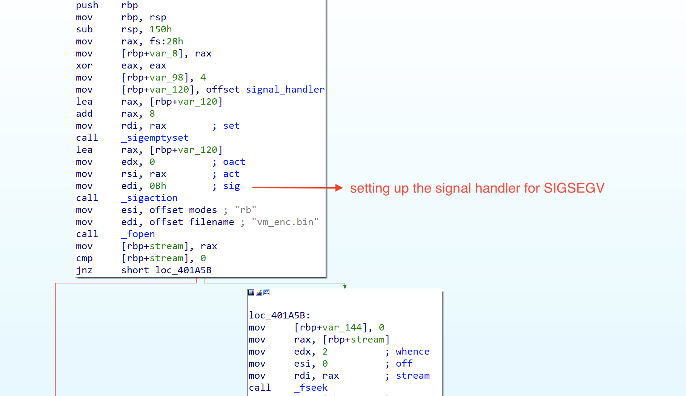
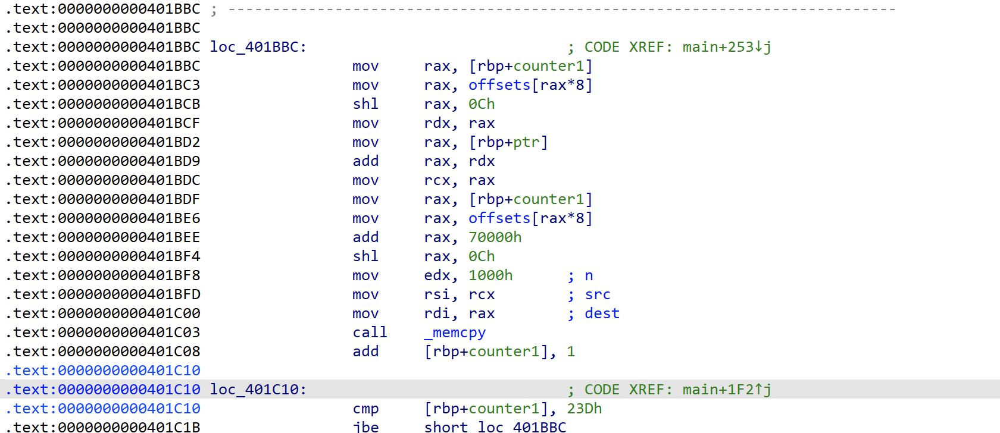
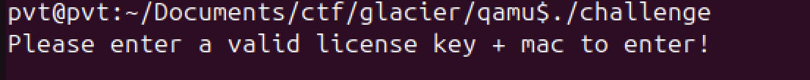
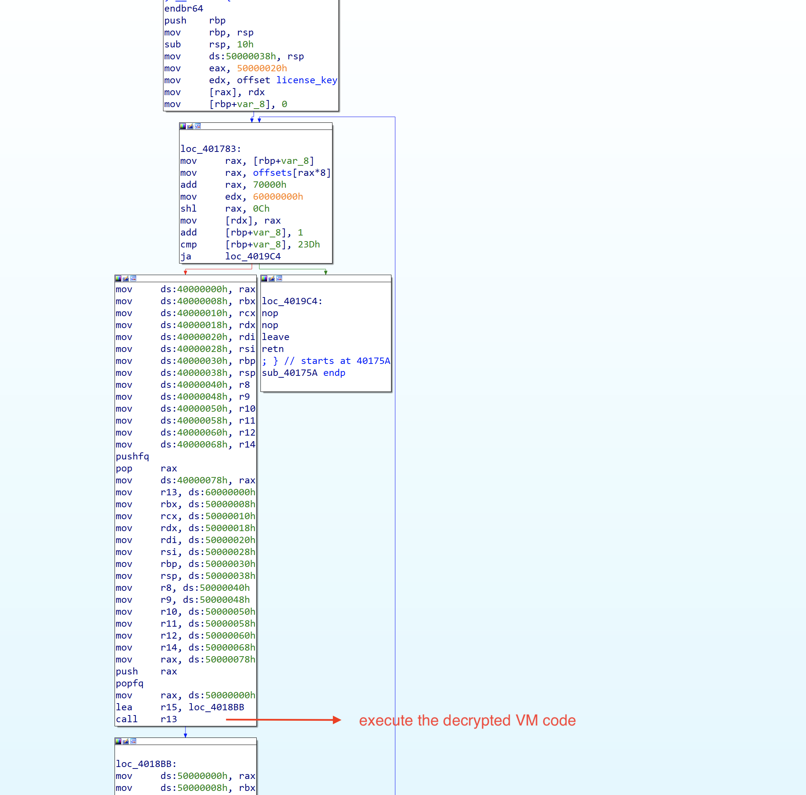
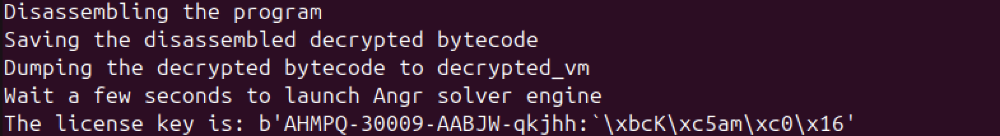

# Glacier CTF 2024 - Qamu reverse engineering challenge write up

| Challenge Name | Qamu |
| -- | -- |
| Solution author | Sudeep Singh |
| Category | Reverse engineering |

## Summary

Recently in Glacier CTF 2024, there was an interesting challenge called "qamu".

You can download the challenge from [here](https://github.com/sudeepvision/sudeepvision.github.io/blob/main/blog/glacier_ctf_2024_qamu_reverse_engineering_challenge/qamu.tar.gz)

## Contents
- Initial analysis
	- SIGSEGV handler setup
	- Memory mapping the encrypted vm_enc.bin
	- Reading the input
- VM execution
- Decryption of code
- Execution of decrypted code
- Re-encryption of code
- Dumping the decrypted program
- Analysis of decrypted program
- Solving for constraints

## Initial analysis

In this challenge, we are provided the below files

- challenge - the 64-bit ELF binary
- flag.txt - local flag which is only used for testing purposes to check whether we solved the challenge successfully. To retrieve the real flag, we need to submit the correct input to the challenge server and retrieve the flag
- vm_enc.bin - this is the encrypted VM that contains the main program

### SIGSEGV handler setup

The main function sets up a signal handler to handle signal with code 0xB (corresponds to SIGSEGV). This is the segmentation fault error. The main program sets the subroutine at address: `0x401725` as the signal handler. This means, each time the program encounters a segmentation fault, it invokes the subroutine at address: `0x401725`



### Memory mapping the encrypted vm_enc.bin

In the next few steps, the main function calculates the size of vm_enc.bin file, and allocates memory of this size using _malloc(). It then maps 5 memory regions at addresses: `0x30000000`, `0x40000000`, `0x50000000`, `0x60000000`, `0x70000000` respectively. After this, the program reads the contents of vm_enc.bin to the previously allocated memory region. The memory mapping scheme, reads 0x1000 bytes at a time from the file `vm_enc.bin`, however it does not read the data sequentially into the memory. Instead, it reads the data using offsets mentioned in .data section at address: `0x4040A0`. This array stores 0x23d qwords, each representing an offset used to specify the location from which data will be read. Its important to note that each byte is represented as a qword in the array at address: `0x4040A0`.



Data is copied to corresponding offsets at memory region: 0x70000000

### Reading the input

Now the binary prompts for the license key. It reads 0x20 bytes from stdin. So, we know the length of the license key is 32 characters.



## VM execution

The subroutine at address: `0x40175A` is the main function that handles the VM execution. It iterates over the memory mapped data at address: 0x70000000 and executes in the same sequence as the offsets mentioned in the offsets array.

The previous mapped memory regions are used to preserve the state of the host program (aka hypervisor in this case) and the guest program (the VM in this case).

- Before executing the VM, it saves the state of all the registers in the memory region: 0x40000000
- After execution of the VM, it saves the state of VM registers in the memory region: 0x50000000
- The address: 0x60000000 only stores the pointer to the next memory region to be executed

Relevant code section is shown below.



`call r13` instruction at address: `0x4018B8` is used to enter the VM. Since the code loaded from `vm_enc.bin` is encrypted, this will result in an exception being thrown.

This exception is handled by the signal handler that decrypts the code.

## Decryption of code

Signal handler passes the address of the memory region with encrypted data to subroutine at address: `0x4015A3`

Analysis of this subroutine reveals the below

1. It constructs a 32-byte decryption key that is passed to the subroutine at address: `0x4012D6` along with the address of encrypted memory region
2. The first 8 bytes of the decryption key are the same as the address of encrypted data.

Decryption key: <8 bytes address of memory region> + b"\x25\xfa\x5b\xc3\x52\xa7\x88\xd5\x5c\x15\xff\x16\xe0\xac\x36\x2a\xe0\xd1\x37\x40\x59\x83\x7d\x55"
3. Analysis of the subroutine at address: `0x4012D6` reveals that it is an RC4 cipher. This is where the knowledge of identifying cryptographic primitives is useful. The RC4 algorithm in this case is implemented without leveraging any third party libraries.
4. After decryption, the memory region is marked as executable by calling `mprotect()`

## Execution of decrypted code

After code is decrypted, the signal handler passes the control back to the decrypted code. Each decrypted code section has 2 valid instructions followed by invalid instructions.

decrypted code section looks like below:
```
<valid ASM instruction>
jmp r15
<invalid ASM instructions>
```

The `jmp r15` instruction passes the control back to `0x4018BB`.

## Re-encryption of code

The code at address: `0x4018BB` saves the state of VM registers, restores the state of hypervisor registers and then calls subroutine at address `0x401664` to re-encrypt the memory region using the same RC4 cipher. After encrypting, it marks the memory region protection as "RW" using `mprotect()`

**Note**: The fact that the hypervisor decrypts the memory region, marks it as RWX, executes it and then re-encrypts it, marking it as "RW" explains the attempt of the challenge author to implement "confidential computing".

## Dumping the decrypted program

Now that we know how the hypervisor executes the encrypted program in `vm_enc.bin`, we can decrypt it. Also, since we know that each decrypted memory region only has two valid instructions with the second instruction always as `jmp r15`, we can dump the first instruction from each memory region to get the decrypted program.

The complete script to decrypt vm_enc.bin, disassemble it and dump the bytecode is available at the end of this article.

## Analysis of decrypted program

The decrypted program is 2077 bytes in size and contains a total of 574 instructions. I've included the entire disassembled code at the end of this article.

A quick analysis of the disassembled program reveals that it is the license key check routine. Below are few observations:

1. rdi is the pointer to the license key
2. checks the characters at offsets 3, 5, 11, 17 and 23 using the below code.

```
cmp	qword ptr [rax + 0x28], 0x2d
sete	r14b
cmp	qword ptr [rax + 0x58], 0x2d
sete	dl
and	edx, r14d
cmp	qword ptr [rax + 0x88], 0x2d
sete	r14b
and	r14d, edx
cmp	qword ptr [rax + 0xb8], 0x3a
sete	dl
and	edx, r14d
cmp	qword ptr [rax + 0x18], 0x50
```

So, we can infer the below few constraints from this:

```
key[3] == 'P'
key[5] == '-'
key[11] == '-'
key[17] == '-'
key[23] == ':'
```

There are many constraints in this program, so manually extracting all the constraints and using it with an SMT solver like Z3 will not be an efficient solution. Instead using a symbolic execution engine like Angr will be suitable for this case.

I have included the complete script in the "Solution script" section. It will automatically do the following:

- Decrypt vm_enc.bin
- Extract the disassembly of the decrypted bytecode
- Dump the decrypted bytecode
- Use the decrypted bytecode with Angr to solve for the constraints and find the license key



**License key**: `AHMPQ-30009-AABJW-qkjhh:\x60\xbcK\xc5am\xc0\x16` 

## Solution script

```python
from Crypto.Cipher import ARC4
import sys
import struct
from capstone import *
import os
import time
import angr
import claripy
from pwn import *
import logging

logging.getLogger('angr').setLevel(logging.ERROR)
logging.getLogger('claripy').setLevel(logging.ERROR)
logging.getLogger('angr.state_plugins.unicorn_engine').setLevel(logging.CRITICAL)

base = 0x70000
size = 0x1000
current_dir = os.path.dirname(os.path.abspath(__file__))

# extract all the offsets from 0x4040A0 in .data section
offsets = ['0x0', '0x1', '0x2', '0x3', '0x4', '0x5', '0x6', '0x7', '0x8', '0x9', '0xa', '0xb', '0xc', '0xd', '0xe', '0xf', '0x8', '0x10', '0x11', '0x12', '0x13', '0x14', '0x15', '0x16', '0x17', '0x8', '0x18', '0x17', '0x19', '0x1a', '0x1b', '0xc', '0x1c', '0x1d', '0x14', '0x1e', '0x1f', '0x1a', '0x20', '0x21', '0x22', '0x23', '0x24', '0x25', '0x26', '0xc', '0x27', '0x28', '0x22', '0x29', '0x17', '0x25', '0x2a', '0x21', '0x14', '0x2b', '0x2c', '0x1a', '0x1b', '0xc', '0x1c', '0x1d', '0x14', '0x1e', '0x1f', '0x1a', '0x20', '0x21', '0x22', '0x23', '0x2d', '0x25', '0x26', '0xc', '0x27', '0x28', '0x22', '0x29', '0x17', '0x25', '0x2a', '0x21', '0x14', '0x2b', '0x2e', '0x1a', '0x1b', '0xc', '0x1c', '0x1d', '0x14', '0x1e', '0x1f', '0x1a', '0x20', '0x21', '0x22', '0x23', '0x2f', '0x25', '0x26', '0xc', '0x27', '0x28', '0x22', '0x29', '0x17', '0x25', '0x2a', '0x21', '0x14', '0x2b', '0x30', '0x1a', '0x1b', '0xc', '0x1c', '0x1d', '0x14', '0x1e', '0x1f', '0x1a', '0x20', '0x21', '0x22', '0x23', '0x31', '0x25', '0x26', '0xc', '0x27', '0x28', '0x22', '0x29', '0x17', '0x25', '0x2a', '0x21', '0x14', '0x2b', '0x32', '0x1a', '0x1b', '0xc', '0x1c', '0x1d', '0x14', '0x1e', '0x1f', '0x1a', '0x20', '0x21', '0x22', '0x23', '0x33', '0x25', '0x26', '0xc', '0x27', '0x28', '0x22', '0x29', '0x17', '0x25', '0x2a', '0x21', '0x14', '0x2b', '0x34', '0x1a', '0x1b', '0xc', '0x1c', '0x1d', '0x14', '0x1e', '0x1f', '0x1a', '0x20', '0x21', '0x22', '0x23', '0x35', '0x25', '0x26', '0xc', '0x27', '0x28', '0x22', '0x29', '0x17', '0x25', '0x2a', '0x21', '0x14', '0x2b', '0x36', '0x1a', '0x1b', '0xc', '0x1c', '0x1d', '0x14', '0x1e', '0x1f', '0x1a', '0x20', '0x21', '0x22', '0x23', '0x37', '0x25', '0x26', '0xc', '0x27', '0x28', '0x22', '0x29', '0x17', '0x25', '0x2a', '0x21', '0x14', '0x2b', '0x38', '0x1a', '0x1b', '0xc', '0x1c', '0x1d', '0x14', '0x1e', '0x1f', '0x1a', '0x20', '0x21', '0x22', '0x23', '0x39', '0x25', '0x26', '0xc', '0x27', '0x28', '0x22', '0x29', '0x17', '0x25', '0x2a', '0x21', '0x14', '0x2b', '0x3a', '0x1a', '0x1b', '0xc', '0x1c', '0x1d', '0x14', '0x1e', '0x1f', '0x1a', '0x20', '0x21', '0x22', '0x14', '0x3b', '0x3c', '0x3d', '0x3e', '0x3f', '0x40', '0x17', '0x1e', '0x41', '0x3c', '0x18', '0x16', '0x42', '0x17', '0x43', '0x44', '0x45', '0x46', '0x47', '0x48', '0x49', '0x45', '0x4a', '0x4b', '0x47', '0x48', '0x4c', '0x45', '0x4a', '0x4d', '0x4e', '0x48', '0x4f', '0x50', '0x4a', '0x51', '0x4e', '0x48', '0x52', '0x45', '0x48', '0x53', '0x54', '0x55', '0x48', '0x56', '0x54', '0x55', '0x48', '0x57', '0x58', '0x54', '0x55', '0x48', '0x59', '0x54', '0x55', '0x48', '0x5a', '0x5b', '0x55', '0x48', '0x5c', '0x5b', '0x55', '0x48', '0x5d', '0x5e', '0x5b', '0x55', '0x48', '0x5f', '0x5e', '0x5b', '0x55', '0x48', '0x60', '0x5e', '0x5b', '0x55', '0x48', '0x61', '0x62', '0x63', '0x45', '0x48', '0x5d', '0x33', '0x64', '0x45', '0x48', '0x65', '0x66', '0x67', '0x45', '0x48', '0x68', '0x69', '0x6a', '0x45', '0x48', '0x6b', '0x6c', '0x6d', '0x45', '0x6e', '0x4a', '0x6f', '0x70', '0x47', '0x71', '0x48', '0x72', '0x73', '0x74', '0x75', '0x76', '0x77', '0x73', '0x74', '0x75', '0x78', '0x79', '0x73', '0x74', '0x7a', '0x7b', '0x72', '0x73', '0x74', '0x7c', '0x7d', '0x7e', '0x73', '0x74', '0x7f', '0x80', '0x77', '0x73', '0x81', '0x82', '0x83', '0x47', '0x84', '0x74', '0x85', '0x73', '0x82', '0x86', '0x87', '0x88', '0x47', '0x89', '0x74', '0x8a', '0x73', '0x8b', '0x74', '0x8c', '0x73', '0x82', '0x8d', '0x8e', '0x8f', '0x47', '0x82', '0x90', '0x91', '0x92', '0x93', '0x94', '0x95', '0x96', '0x97', '0x74', '0x98', '0x99', '0x9a', '0x9b', '0x9c', '0x95', '0x9d', '0x82', '0x9e', '0x91', '0x92', '0x9f', '0xa0', '0xa1', '0x95', '0x96', '0x74', '0xa2', '0x99', '0xa3', '0xa4', '0x95', '0xa5', '0x9a', '0x9d', '0x74', '0xa2', '0x99', '0xa3', '0xa6', '0x95', '0xa5', '0x9a', '0x9d', '0x74', '0xa7', '0x99', '0xa3', '0xa8', '0x95', '0xa5', '0x9a', '0x9d', '0x74', '0xa7', '0x99', '0xa3', '0xa9', '0x95', '0xa5', '0x9a', '0x9d', '0x74', '0xaa', '0x99', '0x9a', '0xab', '0xac', '0x95', '0x9d', '0x74', '0xa7', '0x99', '0xa3', '0x95', '0xa5', '0x9a', '0x9d', '0x74', '0xad', '0x99', '0x9a', '0xae', '0xaf', '0x95', '0x9d', '0x74', '0xb0', '0xb1', '0x73', '0x74', '0xb2', '0xb3', '0x73', '0x74', '0xb4', '0xb5', '0xb6', '0xb7', '0x73', '0x74', '0xb4', '0xb8', '0xb6', '0xb9', '0x73', '0x74', '0xb4', '0xba', '0xb6', '0xbb', '0xbc', '0x73', '0xbd', '0xbe', '0x74', '0xb4', '0xbf', '0xc0', '0xb6', '0xc1', '0x73', '0x74', '0xb4', '0xc2', '0xb6', '0xc3', '0x73', '0xc4', '0x74', '0xc5', '0xc6', '0xc7', '0xc8', '0xc9', '0xca', '0xcb', '0xcc', '0xcd', '0xce', '0xcf', '0xd0', '0xd1']

def solve():
    p = angr.Project("./challenge", auto_load_libs=False)

    INITIAL_ADDR = 0x7000000
    STACK_ADDR = 0xd0000000
    INPUT_ADDR = 0x20000000

    state = p.factory.blank_state(addr=INITIAL_ADDR)

    sc = open("./decrypted_vm", "rb").read()

    x = [claripy.BVS(f"flag{i}", 64) for i in range(0x20)]

    flag = claripy.Concat(*x)

    state.memory.store(INITIAL_ADDR, sc)
    state.memory.store(INPUT_ADDR, flag)

    # rdi points to the license key which is validated by the decrypted program
    state.regs.rdi = INPUT_ADDR
    state.regs.r13 = 0x70000000
    # r15 points to the code inside the hypervisor
    state.regs.r15 = 0x4018bb
    state.regs.rsp = STACK_ADDR

    simgr = p.factory.simulation_manager(state)

    while len(simgr.active):
        simgr.step()
    
    ret = simgr.unconstrained[0].regs.rax

    s = claripy.Solver()

    sol = []

    # return value of the decrypted program should not be 0 to be valid
    s.add(ret != 0)

    for item in x:
        sol.append(s.eval(item, 1)[0])

    sol = [p64(item)[-1] for item in sol]
    print(f'The license key is: {bytes(sol)}')

def disas_and_dump():
    print(f"Disassembling the program")
    opcodes = ""
    asm_code = ""
    for offset in offsets:
            fname = os.path.join(current_dir, "bin", str(int(offset,16)) + ".bin")
            with open(fname,"rb") as f:
                enc = f.read()
            md = Cs(CS_ARCH_X86, CS_MODE_64)
            
            counter = 0
            
            for j in md.disasm(enc, 0):
                asm_code += "%s\t%s\n" %(j.mnemonic, j.op_str)
                opcodes += " ".join(f"{byte:02x} " for byte in j.bytes)
                counter += 1
                # we are extracting only the first instruction
                if counter == 1:
                    break
    
    _dec = bytes.fromhex(opcodes.replace(" ",""))
    
    print(f"Saving the disassembled decrypted bytecode")
    with open("vm.asm", "w") as f:
        f.write(asm_code)
    print(f"Dumping the decrypted bytecode to decrypted_vm")
    with open("decrypted_vm","wb") as f:
                f.write(_dec)

def decrypt_vm(fname):
    with open(fname, "rb") as f:
        contents = f.read()

    decrypted_data = b''

    for i in range(0x23d):
        enc = contents[i * size:i * size + size]
        x = (base + i) << 0xc
        y = struct.pack("<Q", x)
        # first 8 bytes of the RC4 key are the same as the memory address of the encrypted data
        key = y + b"\x25\xfa\x5b\xc3\x52\xa7\x88\xd5\x5c\x15\xff\x16\xe0\xac\x36\x2a\xe0\xd1\x37\x40\x59\x83\x7d\x55"
        rc4 = ARC4.new(key)
        decrypted_data = rc4.decrypt(enc)
        oname = os.path.join(current_dir, "bin/", str(i) + ".bin")
        with open(oname, "wb") as f:
            f.write(decrypted_data)
    return
    
if __name__ == "__main__":
    if len(sys.argv) != 2:
        print(f'usage: python solver.py <filename of the VM>')
        sys.exit()
    _fname = sys.argv[1]
    os.makedirs("bin", exist_ok=True)
    # decrypt vm_enc.bin
    decrypt_vm(_fname)
    # disassemble the code and dump the opcodes
    disas_and_dump()
    print(f"Wait a few seconds to launch Angr solver engine")
    time.sleep(4)
    # run the Angr script to solve the program in decrypted_vm
    solve()
```

### Disassembled program

```asm
push	r14
mov	rax, rdi
push	r12
push	rbp
push	rbx
mov	rsi, qword ptr [rdi + 8]
mov	rbx, qword ptr [rax + 0x70]
mov	r11, qword ptr [rax + 0xa0]
mov	rdx, rsi
lea	rcx, [rsi + rsi*8]
mov	rbp, qword ptr [rax + 0x60]
mov	r9, qword ptr [rdi]
shl	rdx, 5
mov	rdi, qword ptr [rdi + 0x20]
mov	r12, qword ptr [rax + 0x30]
lea	rcx, [rdx + rcx*2]
mov	rdx, rsi
mov	r8, qword ptr [rax + 0x38]
mov	r10, qword ptr [rax + 0xb0]
add	rcx, rsi
shl	rdx, 7
add	rdx, rcx
mov	rcx, rsi
shl	rcx, 8
add	rcx, rdx
mov	rdx, rsi
shl	rdx, 0x28
add	rcx, rdx
xor	rcx, qword ptr [rax + 0x98]
mov	rdx, rcx
lea	r14, [rcx + rcx*8]
shl	rdx, 5
lea	rdx, [rdx + r14*2]
mov	r14, rcx
add	rdx, rcx
shl	r14, 7
add	r14, rdx
mov	rdx, rcx
shl	rcx, 0x28
shl	rdx, 8
add	rdx, r14
lea	r14, [rdx + rcx]
xor	r14, rbx
mov	rdx, r14
lea	rcx, [r14 + r14*8]
shl	rdx, 5
lea	rdx, [rdx + rcx*2]
mov	rcx, r14
add	rdx, r14
shl	rcx, 7
add	rcx, rdx
mov	rdx, r14
shl	r14, 0x28
shl	rdx, 8
add	rdx, rcx
lea	rcx, [rdx + r14]
xor	rcx, qword ptr [rax + 0x68]
mov	rdx, rcx
lea	r14, [rcx + rcx*8]
shl	rdx, 5
lea	rdx, [rdx + r14*2]
mov	r14, rcx
add	rdx, rcx
shl	r14, 7
add	r14, rdx
mov	rdx, rcx
shl	rcx, 0x28
shl	rdx, 8
add	rdx, r14
lea	r14, [rdx + rcx]
xor	r14, qword ptr [rax + 0x10]
mov	rdx, r14
lea	rcx, [r14 + r14*8]
shl	rdx, 5
lea	rdx, [rdx + rcx*2]
mov	rcx, r14
add	rdx, r14
shl	rcx, 7
add	rcx, rdx
mov	rdx, r14
shl	r14, 0x28
shl	rdx, 8
add	rdx, rcx
lea	rcx, [rdx + r14]
xor	rcx, r11
mov	rdx, rcx
lea	r14, [rcx + rcx*8]
shl	rdx, 5
lea	rdx, [rdx + r14*2]
mov	r14, rcx
add	rdx, rcx
shl	r14, 7
add	r14, rdx
mov	rdx, rcx
shl	rcx, 0x28
shl	rdx, 8
add	rdx, r14
lea	r14, [rdx + rcx]
xor	r14, qword ptr [rax + 0x18]
mov	rdx, r14
lea	rcx, [r14 + r14*8]
shl	rdx, 5
lea	rdx, [rdx + rcx*2]
mov	rcx, r14
add	rdx, r14
shl	rcx, 7
add	rcx, rdx
mov	rdx, r14
shl	r14, 0x28
shl	rdx, 8
add	rdx, rcx
lea	rcx, [rdx + r14]
xor	rcx, qword ptr [rax + 0x90]
mov	rdx, rcx
lea	r14, [rcx + rcx*8]
shl	rdx, 5
lea	rdx, [rdx + r14*2]
mov	r14, rcx
add	rdx, rcx
shl	r14, 7
add	r14, rdx
mov	rdx, rcx
shl	rcx, 0x28
shl	rdx, 8
add	rdx, r14
lea	r14, [rdx + rcx]
xor	r14, qword ptr [rax + 0x40]
mov	rdx, r14
lea	rcx, [r14 + r14*8]
shl	rdx, 5
lea	rdx, [rdx + rcx*2]
mov	rcx, r14
add	rdx, r14
shl	rcx, 7
add	rcx, rdx
mov	rdx, r14
shl	r14, 0x28
shl	rdx, 8
add	rdx, rcx
lea	rcx, [rdx + r14]
xor	rcx, rbp
mov	rdx, rcx
lea	r14, [rcx + rcx*8]
shl	rdx, 5
lea	rdx, [rdx + r14*2]
mov	r14, rcx
add	rdx, rcx
shl	r14, 7
add	r14, rdx
mov	rdx, rcx
shl	rcx, 0x28
shl	rdx, 8
add	rdx, r14
lea	r14, [rdx + rcx]
xor	r14, qword ptr [rax + 0x78]
mov	rdx, r14
lea	rcx, [r14 + r14*8]
shl	rdx, 5
lea	rdx, [rdx + rcx*2]
mov	rcx, r14
add	rdx, r14
shl	rcx, 7
add	rcx, rdx
mov	rdx, r14
shl	r14, 0x28
shl	rdx, 8
add	rdx, rcx
lea	rcx, [rdx + r14]
xor	rcx, rdi
mov	rdx, rcx
lea	r14, [rcx + rcx*8]
shl	rdx, 5
lea	rdx, [rdx + r14*2]
mov	r14, rcx
add	rdx, rcx
shl	r14, 7
add	r14, rdx
mov	rdx, rcx
shl	rcx, 0x28
shl	rdx, 8
add	rdx, r14
lea	r14, [rdx + rcx]
xor	r14, r12
mov	rdx, r14
lea	rcx, [r14 + r14*8]
shl	rdx, 5
lea	rdx, [rdx + rcx*2]
mov	rcx, r14
add	rdx, r14
shl	rcx, 7
add	rcx, rdx
mov	rdx, r14
shl	r14, 0x28
shl	rdx, 8
add	rdx, rcx
lea	rcx, [rdx + r14]
xor	rcx, r9
mov	rdx, rcx
lea	r14, [rcx + rcx*8]
shl	rdx, 5
lea	rdx, [rdx + r14*2]
mov	r14, rcx
add	rdx, rcx
shl	r14, 7
add	r14, rdx
mov	rdx, rcx
shl	rcx, 0x28
shl	rdx, 8
add	rdx, r14
lea	r14, [rdx + rcx]
xor	r14, qword ptr [rax + 0x80]
mov	rdx, r14
lea	rcx, [r14 + r14*8]
shl	rdx, 5
lea	rdx, [rdx + rcx*2]
mov	rcx, r14
add	rdx, r14
shl	rcx, 7
add	rcx, rdx
mov	rdx, r14
shl	r14, 0x28
shl	rdx, 8
add	rdx, rcx
lea	rcx, [rdx + r14]
xor	rcx, r8
mov	rdx, rcx
lea	r14, [rcx + rcx*8]
shl	rdx, 5
lea	rdx, [rdx + r14*2]
mov	r14, rcx
add	rdx, rcx
shl	r14, 7
add	r14, rdx
mov	rdx, rcx
shl	rcx, 0x28
shl	rdx, 8
add	rdx, r14
lea	r14, [rdx + rcx]
xor	r14, r10
mov	rdx, r14
lea	rcx, [r14 + r14*8]
shl	rdx, 5
lea	rdx, [rdx + rcx*2]
mov	rcx, r14
add	rdx, r14
shl	rcx, 7
add	rcx, rdx
mov	rdx, r14
shl	r14, 0x28
shl	rdx, 8
add	rdx, rcx
lea	rcx, [rdx + r14]
xor	rcx, qword ptr [rax + 0x48]
mov	rdx, rcx
lea	r14, [rcx + rcx*8]
shl	rdx, 5
lea	rdx, [rdx + r14*2]
mov	r14, rcx
add	rdx, rcx
shl	r14, 7
add	r14, rdx
mov	rdx, rcx
shl	rcx, 0x28
shl	rdx, 8
add	rdx, r14
add	rdx, rcx
xor	rdx, qword ptr [rax + 0x50]
mov	rcx, rdx
lea	r14, [rdx + rdx*8]
shl	rcx, 5
lea	rcx, [rcx + r14*2]
mov	r14, rdx
add	rcx, rdx
shl	r14, 7
add	r14, rcx
mov	rcx, rdx
shl	rdx, 0x28
shl	rcx, 8
add	rcx, r14
add	rcx, rdx
xor	rcx, qword ptr [rax + 0xa8]
cmp	qword ptr [rax + 0x28], 0x2d
sete	r14b
cmp	qword ptr [rax + 0x58], 0x2d
sete	dl
and	edx, r14d
cmp	qword ptr [rax + 0x88], 0x2d
sete	r14b
and	r14d, edx
cmp	qword ptr [rax + 0xb8], 0x3a
sete	dl
and	edx, r14d
cmp	qword ptr [rax + 0x18], 0x50
sete	r14b
and	r14d, edx
cmp	r9, rsi
setne	dl
and	edx, r14d
cmp	r12, r8
setne	r14b
and	r14d, edx
cmp	qword ptr [rax + 0x18], rdi
setne	dl
and	edx, r14d
cmp	r9, rbp
sete	r14b
and	edx, r14d
lea	r14, [r9 - 0x41]
cmp	r14, 0x19
setbe	r14b
and	edx, r14d
lea	r14, [rsi - 0x41]
cmp	r14, 0x19
setbe	r14b
and	edx, r14d
mov	r14, qword ptr [rax + 0x10]
sub	r14, 0x41
cmp	r14, 0x19
setbe	r14b
and	edx, r14d
lea	r14, [rdi - 0x41]
cmp	r14, 0x19
setbe	r14b
and	edx, r14d
lea	r14, [r12 - 0x30]
cmp	r14, 9
setbe	r14b
and	edx, r14d
lea	r14, [r8 - 0x30]
cmp	r14, 9
setbe	r14b
and	edx, r14d
mov	r14, qword ptr [rax + 0x40]
sub	r14, 0x30
cmp	r14, 9
setbe	r14b
and	edx, r14d
mov	r14, qword ptr [rax + 0x48]
sub	r14, 0x30
cmp	r14, 9
setbe	r14b
and	edx, r14d
mov	r14, qword ptr [rax + 0x50]
sub	r14, 0x30
cmp	r14, 9
setbe	r14b
and	edx, r14d
mov	r14, qword ptr [rax + 0x98]
and	r14, rsi
cmp	r14, 0x48
sete	r14b
and	edx, r14d
mov	r14, qword ptr [rax + 0x40]
xor	r14, qword ptr [rax + 0x78]
cmp	r14, 0x7a
sete	r14b
and	edx, r14d
mov	r14, rsi
and	r14, rdi
cmp	r14, 0x40
sete	r14b
and	edx, r14d
mov	r14, qword ptr [rax + 0x90]
xor	r14, rdi
cmp	r14, 0x20
sete	r14b
and	edx, r14d
mov	r14, r9
or	r14, r11
cmp	r14, 0x6b
sete	r14b
xor	rsi, qword ptr [rax + 0x80]
and	r14d, edx
cmp	rsi, 0x1f
mov	rsi, qword ptr [rax + 0x88]
sete	dl
add	rsi, qword ptr [rax + 0x10]
and	edx, r14d
cmp	rsi, 0x7a
sete	sil
and	edx, esi
mov	rsi, qword ptr [rax + 0x48]
or	rsi, r8
cmp	rsi, 0x30
sete	sil
and	edx, esi
mov	rsi, qword ptr [rax + 0x48]
add	rsi, rbx
cmp	rsi, 0x72
sete	sil
and	edx, esi
mov	rsi, qword ptr [rax + 0x50]
add	rsi, qword ptr [rax + 0x68]
cmp	rsi, 0x7a
sete	sil
and	edx, esi
mov	rsi, qword ptr [rax + 0x58]
or	rsi, rbx
cmp	rsi, 0x6f
sete	sil
and	edx, esi
mov	rsi, qword ptr [rax + 0x90]
and	rsi, r8
cmp	rsi, 0x30
sete	sil
or	r9, r10
and	esi, edx
cmp	r9, 0x69
sete	dl
xor	r8, r11
and	edx, esi
cmp	r8, 0x5a
sete	sil
and	esi, edx
mov	rdx, qword ptr [rax + 0x98]
xor	rdx, r12
cmp	rdx, 0x58
sete	dl
or	rdi, rbp
and	edx, esi
cmp	rdi, 0x51
sete	sil
and	r12, qword ptr [rax + 0x40]
and	edx, esi
cmp	r12, 0x30
sete	sil
and	esi, edx
mov	rdx, qword ptr [rax + 0x78]
and	rdx, r10
cmp	rdx, 0x48
sete	dl
and	esi, edx
lea	rdx, [rbp - 0x41]
cmp	rdx, 0x19
setbe	dl
sub	rbp, 0x30
cmp	rbp, 9
setbe	dil
or	edx, edi
mov	rdi, qword ptr [rax + 0x68]
and	edx, esi
lea	rsi, [rdi - 0x41]
cmp	rsi, 0x19
setbe	sil
sub	rdi, 0x30
cmp	rdi, 9
setbe	dil
or	esi, edi
and	esi, edx
lea	rdx, [rbx - 0x41]
cmp	rdx, 0x19
setbe	dl
sub	rbx, 0x30
cmp	rbx, 9
mov	rbx, qword ptr [rax + 0x78]
setbe	dil
or	edx, edi
and	edx, esi
lea	rsi, [rbx - 0x41]
cmp	rsi, 0x19
lea	rsi, [rbx - 0x30]
mov	rbx, qword ptr [rax + 0x80]
setbe	dil
cmp	rsi, 9
setbe	sil
or	esi, edi
and	edx, esi
lea	rsi, [rbx - 0x41]
cmp	rsi, 0x19
lea	rsi, [rbx - 0x30]
mov	rbx, qword ptr [rax + 0x90]
setbe	dil
cmp	rsi, 9
setbe	sil
or	esi, edi
and	edx, esi
lea	rsi, [rbx - 0x61]
cmp	rsi, 0x19
lea	rsi, [rbx - 0x30]
mov	rbx, qword ptr [rax + 0x98]
setbe	dil
cmp	rsi, 9
setbe	sil
or	esi, edi
and	edx, esi
lea	rsi, [rbx - 0x61]
cmp	rsi, 0x19
lea	rsi, [rbx - 0x30]
mov	rbx, qword ptr [rax + 0xa8]
setbe	dil
cmp	rsi, 9
setbe	sil
or	esi, edi
and	edx, esi
lea	rsi, [r11 - 0x61]
cmp	rsi, 0x19
setbe	sil
sub	r11, 0x30
cmp	r11, 9
setbe	dil
or	esi, edi
and	edx, esi
lea	rsi, [rbx - 0x61]
cmp	rsi, 0x19
lea	rsi, [rbx - 0x30]
setbe	dil
cmp	rsi, 9
setbe	sil
or	esi, edi
and	edx, esi
lea	rsi, [r10 - 0x61]
cmp	rsi, 0x19
setbe	sil
sub	r10, 0x30
cmp	r10, 9
setbe	dil
or	esi, edi
and	edx, esi
movzx	esi, cl
cmp	qword ptr [rax + 0xc0], rsi
sete	sil
and	edx, esi
movzx	esi, ch
cmp	qword ptr [rax + 0xc8], rsi
sete	sil
and	edx, esi
mov	rsi, rcx
shr	rsi, 0x10
movzx	esi, sil
cmp	qword ptr [rax + 0xd0], rsi
sete	sil
and	edx, esi
mov	rsi, rcx
shr	rsi, 0x18
movzx	esi, sil
cmp	qword ptr [rax + 0xd8], rsi
sete	sil
and	edx, esi
mov	rsi, rcx
shr	rsi, 0x20
movzx	esi, sil
cmp	qword ptr [rax + 0xe0], rsi
pop	rbx
sete	sil
pop	rbp
pop	r12
and	edx, esi
mov	rsi, rcx
pop	r14
shr	rsi, 0x28
movzx	esi, sil
cmp	qword ptr [rax + 0xe8], rsi
sete	sil
and	edx, esi
mov	rsi, rcx
shr	rsi, 0x30
movzx	esi, sil
cmp	qword ptr [rax + 0xf0], rsi
sete	sil
shr	rcx, 0x38
and	edx, esi
cmp	qword ptr [rax + 0xf8], rcx
sete	al
movzx	eax, al
and	eax, edx
xor	edx, edx
xor	ecx, ecx
xor	esi, esi
xor	edi, edi
xor	r8d, r8d
xor	r9d, r9d
xor	r10d, r10d
xor	r11d, r11d
ret
```


