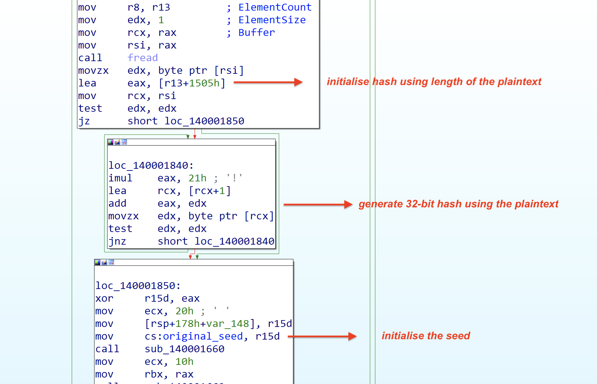
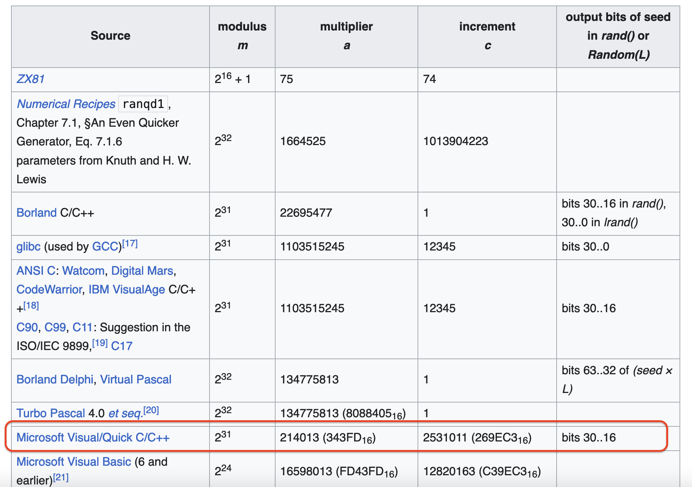
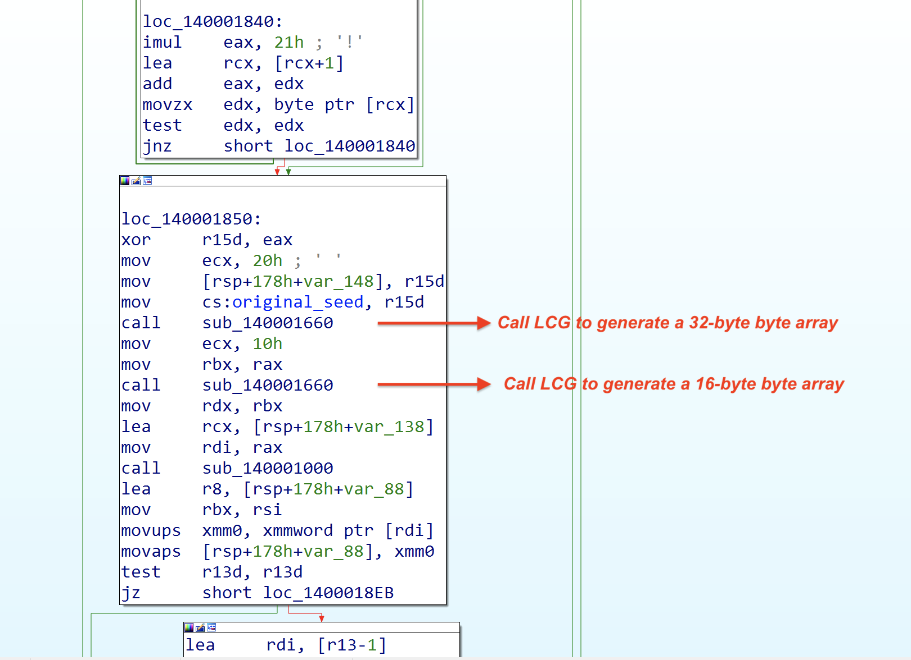
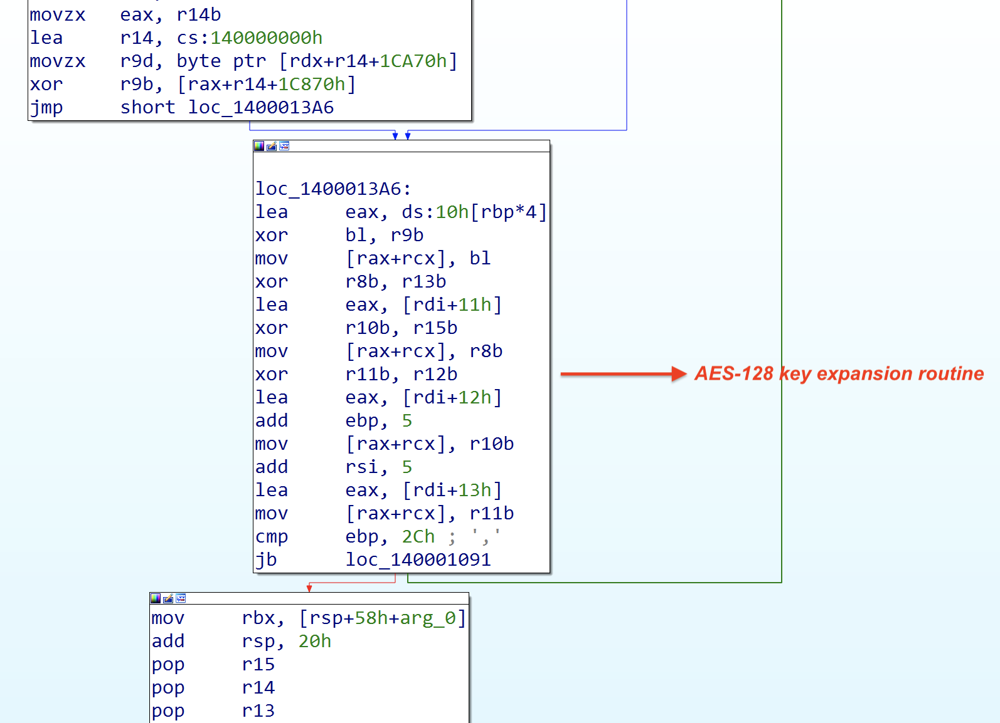
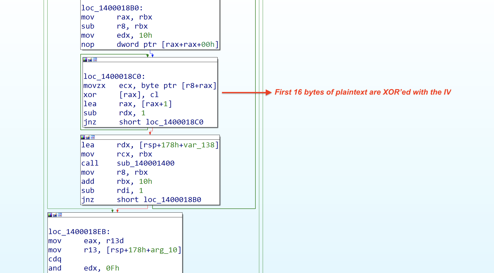
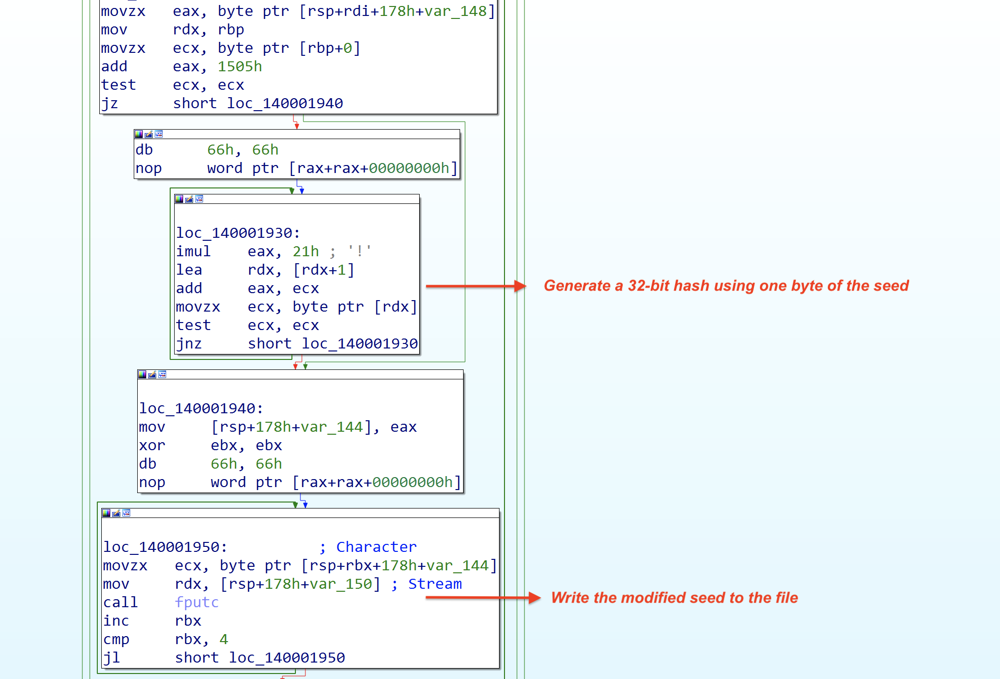
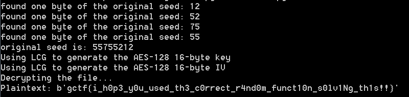

In this challenge, we are given a 64-bit Windows binary and a file called `flag.txt.enc` that contains the encrypted flag. Goal of this challenge is to decrypt the `flag.txt.enc` file and obtain the flag.

## Contents
- Initial analysis
- Generation of seed
- Identification of cryptographic primitives
- Modification of seed
- Parsing the encrypted file
- Bruteforcing original seed
- Decrypting the file

## Initial analysis

Upon an initial analysis of the binary, we can observe the following:

1. Binary accepts the name of the plaintext file as an input.
2. Encrypted output will be written to a file with the same name and `.enc` file extension appended to it.
3. A 32-bit seed is generated and used to initialise a pseudorandom number generator (PRNG).
4. The original seed is modified and written to the output file along with the encrypted data.

Now that we have done a quick analysis, let us understand the algorithms in more detail.

## Generation of seed

Subroutine at address `0x140006CAC` is used to generate a 32-bit value. This is followed by generation of another 32-bit hash using the contents of the plaintext as shown below.



It uses the length of the plaintext as an input to initialise a hash and then uses the contents of the plaintext to compute a 32-bit hash. The computed 32-bit hash is XOR'ed with the 32-bit value generated using subroutine at address `0x140006CAC`. The resulting 32-bit value is the original seed which is saved in a variable `.data` section.

## Identification of the cryptographic primitives

Right after generating the seed, we can see it calls a subroutine at address: `0x140001660`. By analysing the code, we can see that it uses a mulitplier with value `0x343FD` and an incrementer with value `0x269EC3`. This looks very similar to LCG (linear congruential generator) algorithm. We can confirm it by looking up the table [here](https://en.wikipedia.org/wiki/Linear_congruential_generator)

This table shows the paramters of LCG used by different compilers. The parameters used by Microsoft Visual/Quick C/C++ are the same as the parameters in our case which further confirms the algorithm being used.



LCGs are often used to generate pseudorandom numbers.

LCG in our case is called two times to generate a 32-byte pseudorandom byte array and a 16-byte pseudorandom byte array. Its important to note that LCG updates the original seed in the `.data` section upon each call. So the next call to LCG uses the updated seed.



Now that we know LCG was used to generate 2 byte arrays, let us understand what these byte arrays are.

The cryptographic primitives used in this binary are not easily evident since it does not use any library functions. However, a quick analysis of the subroutine at address: `0x140001000` reveals that it is an AES key expansion routine. This function receives the 32-byte byte array generated by the LCG as an input. It uses only the first 16 bytes in the key expansion routine.

As seen in the code section below, it generates 4 bytes in every iteration with a total of 44 iterations. As a result of this, the 16-byte key is expanded to 176 bytes.



Next, we can see in the code section below that the first 16 bytes of the plaintext are XOR'ed with the 16-byte byte array generated by the LCG.



Based on this, we can quickly assess that the cryptographic primitive used in this case is AES-128. The key and IV are generated by the LCG.

- LCG used to generate 32-bytes results in the AES-128 key (note: only the first 16 bytes of the output are used as the key)
- LCG used to generate 16-bytes results in the AES-128 IV.

The block cipher mode is CBC because every 16 bytes are encrypted using the previous encrypted block.

## Modification of seed

Since the seed is used by the LCG to generate the AES-128 key and IV in this case, it is important to protect the seed. That's why the binary modifies the seed before writing it to the file. The code section below shows the seed modification routine. Each byte of the original seed is used along with the filename to generate a 32-bit hash. This 32-bit hash is written to the output file. Since the seed is a 4-byte value, there will be 4 32-bit hashes generated for each byte of the seed.



## Parsing the encrypted file

The modified seeds and the AES encrypted data are written to the output file in the format below.

```
[4 bytes of modified seed][16 bytes of AES encrypted data][4 bytes of modified seed][16 bytes of AES encrypted data]...
```

In order to solve this challenge, we need to parse the binary accordingly to extract all the 4 32-bit hashes and the AES encrypted data.

## Bruteforcing the original seed

The algorithm used to modify the seed can be reversed. Only 1 byte of the seed is used along with the filename to generate the 32-bit hash. Since we know the filename, we can bruteforce the single byte. This way, we can use each of the 32-bit hashes to bruteforce and recover bytes of the seed, one byte at a time.

## Decrypting the file

Now that we know how to recover the seed and what cryptographic primitives are used, we can write the decrypter. I have shared the complete solution script I wrote to solve this challenge.

## Solution



**Flag**: `gctf{i_h0p3_y0u_used_th3_c0rrect_r4nd0m_funct10n_s0lv1Ng_th1s!!}`

## Solution script

```python
from Crypto.Cipher import AES

# bruteforce one byte of the original seed
def brute_seed_byte(_filename, modified_seed):
    for lsb_seed in range(0xff):
        hash = 0x1505 + lsb_seed
        for i in range(len(_filename)):
            hash = (ord(_filename[i]) + 0x21 * hash) & 0xffffffff
        if hash == modified_seed:
            print(f"found one byte of the original seed: {lsb_seed:x}")
            return lsb_seed


# parse the encrypted data file to extract the modified seeds
# and the encrypted data
def parse_binary_file(file_path):
    seeds = []
    encrypted_data = b''

    with open(file_path, 'rb') as f:
        while True:
            # Read 4 bytes for the seed
            seed = f.read(4)
            if not seed:
                break
            
            # seed is stored in Little endian format in the data
            seed = int.from_bytes(seed, byteorder='little')     
            # Append the seed to the list
            seeds.append(seed)

            # Read 16 bytes of encrypted data
            encrypted_chunk = f.read(16)
            if not encrypted_chunk:
                break

            # Append the encrypted data to the final concatenated result
            encrypted_data += encrypted_chunk

    return seeds, encrypted_data
    
def lcg_func(a1, seed):
    multiplier = 0x343FD
    increment = 0x269EC3

    result = [0] * (a1 + 1)

    if a1 <= 0:
        result[a1] = 0
    else:
        v5 = seed
        for i in range(a1):
            v5 = (multiplier * v5 + increment) & 0xFFFFFFFF
            hi_word = (v5 >> 16) & 0x7FFF
            result[i] = (hi_word % 0x5E) + 0x20
        seed = v5
        result[a1] = 0

    return result, seed

def decrypt_file(encrypted_data, key, iv):
    if len(key) != 16 or len(iv) != 16:
        raise ValueError("Key and IV must be 16 bytes each.")

    # Create AES cipher object in CBC mode
    cipher = AES.new(key, AES.MODE_CBC, iv)

    # Decrypt the encrypted data
    plaintext = cipher.decrypt(encrypted_data)
    
    return plaintext

if __name__ == "__main__":
    input_file = "flag.txt.enc"
    _filename = "flag.txt"
   
    modified_seeds, encrypted_data = parse_binary_file(input_file)
    
    # Retrieve the original seed using the modified seeds
    
    correct_seeds = []
    
    for i in range(len(modified_seeds)):
        lsb_seed = brute_seed_byte(_filename, modified_seeds[i])
        correct_seeds.append(lsb_seed)
    
    original_seed = correct_seeds[3] << 24 | correct_seeds[2] << 16 | correct_seeds[1] << 8 | correct_seeds[0]
    print(f'original seed is: {original_seed:x}')
    
    print("Using LCG to generate the AES-128 16-byte key")
    k1, updated_seed = lcg_func(32, original_seed)
    key = ''.join([chr(c) for c in k1])[:16].encode('utf-8')
    print("Using LCG to generate the AES-128 16-byte IV")
    iv1, t = lcg_func(16, updated_seed)
    iv = ''.join([chr(c) for c in iv1]).rstrip('\0').encode('utf-8')
    
    print("Decrypting the file...")
    try:
        plaintext = decrypt_file(encrypted_data, key, iv)
        print(f"Flag: {plaintext}")
    except Exception as e:
        print(f"Error: {e}")
        raise
```
