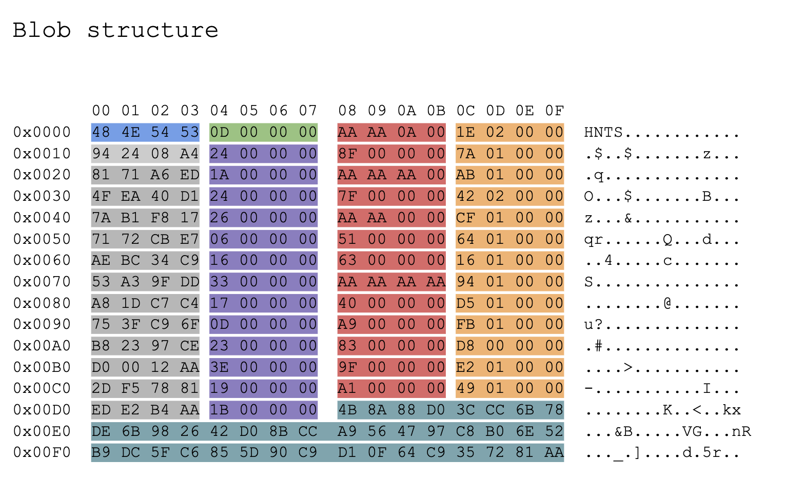

# Huntress CTF 2025 - Rust Tickler 2 reverse engineering challenge write up

### Overview

| Challenge name | Rust tickler 2 |
| --- | --- |
| Solution author | Sudeep Singh |
| Category | Reverse engineering |

 

In this challenge, we are provided a 64-bit Rust-based binary. This binary decrypts an encrypted blob at runtime and this blob contains an encrypted string table which is further decrypted at runtime using an LCG-based decryption algorithm.

One of the strings in the encrypted string table is related to the flag.

### Initialisation of the encrypted blob

It first builds an encrypted blob of length 0x268 bytes on the stack in the subroutine, sub_1400019B0 as shown below.

 

This stack string is converted into a string object and stored on the heap. The pointer to the encrypted string is stored in the .data section at 0x1400240E8 and the length is stored at 0x1400240F0

 

### XOR decryption of the encrypted blob

This encrypted blob is decrypted using a XOR-based decryption algorithm using 0x33333333333333333333333333333333 as the key

 

### Structure of the blob

Below is the structure of the blob containing the encrypted string table.

 

Below is a description of the blob structure.

1. First 4 bytes contain the magic signature of the blob: [53 54 4E 48] or "HNTS" in ASCII.
2. Next 4 bytes contain the count of the encrypted strings. This is the number of encrypted strings stored in the string table. The string table begins right after this.

Below is description of the structure corresponding to each encrypted string

| Offset | Size | Description |
| --- | --- | --- |
| 0 | 4 | Marker used to locate the structure on the heap |
| 4 | 4 | Offset to find the encrypted string in the blob |
| 8 | 4 | Seed in the Linear Congruential Generator (LCG) decryption algorithm |
| 12 | 4 | Length of the encrypted string |

We can represent this entire blob structure as below.

```
typedef struct _ENCRYPTED_STRING_ENTRY {
    uint32_t marker;   // marker pattern
    uint32_t offset;   // offset to the encrypted byte array
    uint32_t seed;     // PRNG seed used for LCG-based decryption later
    uint32_t length;   // length of encrypted byte array in bytes
} ENCRYPTED_STRING_ENTRY;

typedef struct _BLOB1_HEADER {
    uint32_t magic;    // 'HNTS' (0x53544E48)
    uint32_t count;    // number of ENCRYPTED_STRING_ENTRY entries
    ENCRYPTED_STRING_ENTRY entries[]; // array of encrypted string entries
    // Followed in memory by the concatenated encrypted byte arrays
} BLOB1_HEADER;
```

### String decryption

Each encrypted string in the string table in blob1 is decrypted in the subroutine, sub_140004300 as shown below.

 

This decryption algorithm uses LCG and the seed for this LCG is also fetched from the encrypted string entry structure in the blob.

So I wrote the below code to parse the blob and decrypt all the 13 strings

```python
#!/usr/bin/env python3
import struct
import sys

def decrypt_bytes(data: bytes, seed: int) -> bytes:
    buf = bytearray(data)
    v9 = seed & 0xFFFFFFFF
    v10 = 0
    size = len(buf)

    while v10 < size:
        key = ((1664525 * v9 + 1013904223) >> 24) & 0xFF
        buf[v10] ^= key

        v9 = (389569705 * v9 + 1196435762) & 0xFFFFFFFF

        if v10 + 1 < size:
            key2 = (v9 >> 24) & 0xFF
            buf[v10 + 1] ^= key2

        v10 += 2

    return bytes(buf)

def parse_and_decrypt_blob1(path: str):
    with open(path, "rb") as f:
        data = f.read()

    def dword(off):
        return struct.unpack_from("<I", data, off)[0]

    off = 0
    magic = dword(off); off += 4
    count = dword(off); off += 4
    print(f"Magic: 0x{magic:08X}  Count: {count}")

    entries = []
    for i in range(count):
        marker = dword(off); off += 4
        offset = dword(off); off += 4
        seed   = dword(off); off += 4
        length = dword(off); off += 4
        entries.append((marker, offset, seed, length))

    for idx, (marker, offset, seed, length) in enumerate(entries):
        enc = data[offset:offset + length]
        dec = decrypt_bytes(enc, seed)
        enc_hex = " ".join(f"{b:02X}" for b in enc)
        dec_str = ''.join(chr(b) if 32 <= b < 127 else '.' for b in dec)
        print(f"[{idx}] marker=0x{marker:08X} seed=0x{seed:08X} len={length}")
        print(f"     encrypted: [{enc_hex}]")
        print(f"     decrypted: {dec_str}\n")

if __name__ == "__main__":
    if len(sys.argv) != 2:
        print(f"Usage: {sys.argv[0]} <blob1.bin>")
        sys.exit(1)

    parse_and_decrypt_blob1(sys.argv[1])
```

Below is the output of above code

 

As we can see, the flag is stored at index 3 in the string table.

Flag is: `flag{f59a5f604d236425490133c3fac89a88}`


