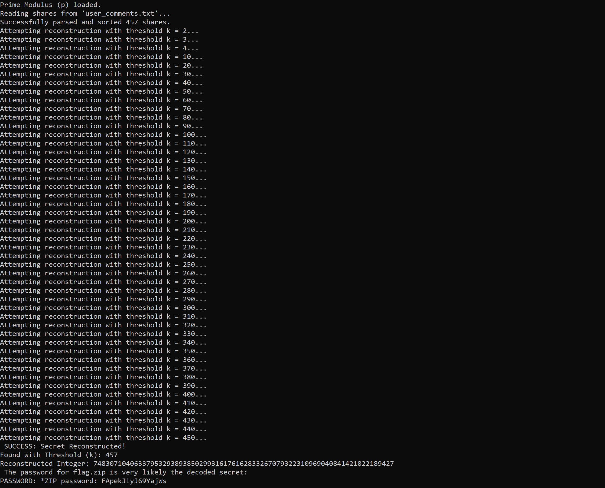
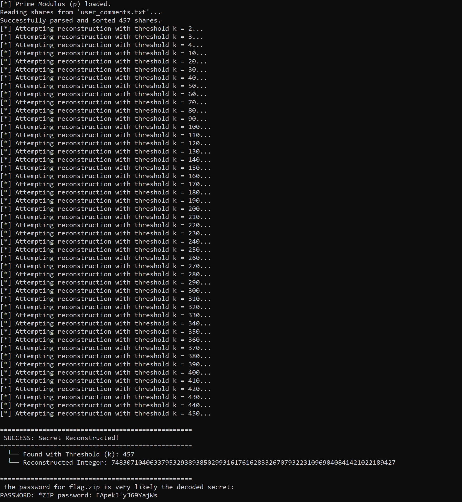

# Vx-underground Miscellaneous challenge write up 

### Overview

| Challenge name | vx-underground |
| --- | --- |
| Solution author | Sudeep Singh |
| Category | Miscellaenous |



In this challenge, we are provided an archive file, vx-underground.zip.

Below are the contents of this archive file.

```
└── vx-underground
    ├── Cat Archive
    │   ├── 000b8a1b1806920c5cec4a0ae10ec048209dad7596cfce219b9c2c3e1dc7f5f4.jpg
    │   ├── 000c18880dc4af8a046aa78daeedf08e3fd575614df8e66e4cfbfd50a740ea77.jpg
    │   ├── 000cb28f57ae572ba83149b2163f9076cdb9660310a8bf2547a19816cf611775.jpg
......
    │   ├── 0fbd99266b437eae047d882218bdb091961d3c31f8ec514c9a6474976a35517e.jpg
    │   ├── 0fc03f8a91a287ad3d86d9bfb5903dbb89f81dafd53477579053febf3720497f.jpg
....
    │   └── 0ff8658055ea93f30482de8a990600c2f8a301a1a2632afbffda5f60cac2e1c5.jpg
    ├── flag.zip
    └── prime_mod.jpg
```

### Analysis

The directory, "Cat Archive" contains 457 images. By checking the metadata of these image files, we observe that each image has a SHA256 hash embedded in the "User Comment" field as shown below.

```
$ exiftool 0fdd334e775ced15f79d50813c6bd6f2281fbef8dfc324d468cdc6e35d8fd263.jpg  
ExifTool Version Number         : 13.36
File Name                       : 0fdd334e775ced15f79d50813c6bd6f2281fbef8dfc324d468cdc6e35d8fd263.jpg
Directory                       : .
File Size                       : 318 kB
...
User Comment                    : 161-f72877af62cb96fd98887221d7568065cd1a506c4e19bb6aea78d5297261c637
Image Width                     : 1536
....
```

Next, I performed a few quick checks to see if all the images contain "User Comment" field.

```
$ exiftool * | grep "User Comment" | wc -l 
     457
```

So now we know that each image contains a "User Comment" field

Next I extracted all these user comments into a text file
```
$ exiftool * | grep "User Comment" | cut -d":" -f2 | sed -e 's/^[ \t]*//' | sort -t- -k1,1n | head -n 10
1-d278c2aad8f1c0de7023b4ec81df35fd9515a4330d5db48fda746c0548c200f5
2-60cf3885dabd878c2f24cd503b02db29c7c2dfdad310a8ec9c0d826b8d84ff2f
3-f84c72ebf84336085a6f1013ccff8cd987a0baa1c6d5c0fb650b14b4daf6ca2f
4-b2ebc1f2cc12460fbafb34975e12ecb4e0d5c6fde61ed64ae8c6c99a97c11cb3
5-51e10e577e79c3bb548d4fa0abc2809926c22c1d39a068d4804ed5f78db5aa05
6-9ed77e10474f730060a401af72bbffc311e7b6fb0dada2596dbe825fac7cb0d3
7-2df0e88c067f0337018463a171c80966669f5b1338cf8b701d450cf75bd10828
8-0d29bad043e5506debddfb41419839332e6d55c6586622dbf636d69dc12a824d
9-5a022d51d3afa18b614a4c2bdcecb159fb7930b1b6fbcecf737a08034a065980
10-e7f254644a03a550110e2be89160ad50f0561f7387cf8a7d181a7619decb12ca

$ exiftool * | grep "User Comment" | cut -d":" -f2 | sed -e 's/^[ \t]*//' | sort -t- -k1,1n >> user_comments.txt
```

Each of these user comments follows a particular format.

`<index>-<SHA256 hash>`

This reminds of the Shamir Secret Sharing method in which a secret is split into N parts. Before we proceed solving for Shamir Secret Sharing, it is important to note that a prime modulus was also provided in the metadata of the `prime_mod.jpg` image as shown below.

```
$ exiftool prime_mod.jpg | grep "User Comment"
User Comment                    : Prime Modulus: 010000000000000000000000000000000000000000000000000000000000000129
```

This value is the same as `2 ** 256 + 297` which is a large prime number.

Each shared secret can be represented as a point (x,y) and we need to find a polynomial corresponding to these points. By solving for f(x) at x = 0, we can find the secret. In order to find the polynomial, we will use Lagrange interpolation plot. It is also important to note that we will do all the calculations over GF(p) where is the p is the prime modulus.

I wrote the below code to reconstruct the secret using Lagrange interpolation plot. Since we don't know the threshold required to reconstruct the secret, we will try various thresholds.

```
import sys

SHARES_FILENAME = "user_comments.txt"
PRIME_MOD_HEX = "010000000000000000000000000000000000000000000000000000000000000129"

def load_shares_from_file(filename):
    print(f"Reading shares from '{filename}'...")
    parsed_shares = []
    try:
        with open(filename, 'r') as f:
            for line in f:
                line = line.strip()
                if not line:
                    continue
                try:
                    index_str, y_hex = line.split('-', 1)
                    x = int(index_str)
                    y = int(y_hex, 16)
                    parsed_shares.append((x, y))
                except ValueError:
                    pass
    except FileNotFoundError:
        print(f"Error: The file '{filename}' was not found.")
        return None
    
    parsed_shares.sort(key=lambda s: s[0])
    return parsed_shares

def egcd(a, b):
    if a == 0:
        return (b, 0, 1)
    else:
        g, y, x = egcd(b % a, a)
        return (g, x - (b // a) * y, y)

def mod_inverse(a, m):
    g, x, y = egcd(a, m)
    if g != 1:
        raise Exception('Modular inverse does not exist')
    return x % m

def reconstruct_secret(shares, p):
    if len(shares) < 2:
        return None

    x_coords, y_coords = zip(*shares)
    
    secret = 0
    for i in range(len(shares)):
        numerator = 1
        denominator = 1
        for j in range(len(shares)):
            if i == j:
                continue
            numerator = (numerator * -x_coords[j]) % p
            denominator = (denominator * (x_coords[i] - x_coords[j])) % p
        
        try:
            inv_denominator = pow(denominator, -1, p)
        except ValueError:
             inv_denominator = mod_inverse(denominator, p)
             
        term = (y_coords[i] * numerator * inv_denominator) % p
        secret = (secret + term) % p
        
    return secret

def main():
    p = int(PRIME_MOD_HEX, 16)
    print(f"Prime Modulus (p) loaded.")
    
    shares = load_shares_from_file(SHARES_FILENAME)
    if not shares:
        return
        
    print(f"Successfully parsed and sorted {len(shares)} shares.")

    for k in range(2, len(shares) + 1):
        if k % 10 == 0 or k < 5:
            print(f"Attempting reconstruction with threshold k = {k}...")
        
        shares_to_try = shares[:k]
        
        secret_int = reconstruct_secret(shares_to_try, p)
        
        try:
            byte_length = (secret_int.bit_length() + 7) // 8
            secret_bytes = secret_int.to_bytes(byte_length, 'big')
            
            decoded_secret = secret_bytes.decode('ascii')
            
            if all(c.isprintable() for c in decoded_secret) and len(decoded_secret) > 4:
                print(" SUCCESS: Secret Reconstructed! ")
                print(f"Found with Threshold (k): {k}")
                print(f"Reconstructed Integer: {secret_int}")
                
                print(" The password for flag.zip is the decoded secret:")
                print(f"PASSWORD: {decoded_secret}")
                return
                
        except (UnicodeDecodeError, OverflowError):
			pass
            
    print(f"\nFailed to find a printable secret after trying all thresholds up to k={len(shares)}.")

if __name__ == "__main__":
    main()
```

Below is the output of the script and we can see it successfully reconstruct the secret as: `*ZIP password: FApekJ!yJ69YajWs`



Now we can extract the contents of flag.zip using the password, `FApekJ!yJ69YajWs`. The extracted file, `cute-kitty-noises.txt` again uses a custom encoding as shown below.

```
MeowMeow;MeowMeowMeowMeowMeowMeowMeowMeowMeowMeowMeowMeowMeowMeowMeowMeowMeowMeowMeowMeowMeowMeowMeowMeowMeowMeowMeowMeowMeowMeowMeowMeowMeowMeowMeowMeowMeowMeowMeowMeowMeowMeowMeowMeowMeowMeowMeowMeowMeowMeowMeowMeowMeowMeowMeowMeowMeowMeowMeowMeowMeowMeowMeowMeowMeowMeowMeowMeowMeowMeowMeowMeowMeowMeowMeowMeowMeowMeowMeowMeowMeowMeowMeowMeowMeowMeowMeowMeowMeowMeowMeowMeowMeowMeowMeowMeowMeowMeowMeowMeowMeowMeowMeowMeowMeowMeowMeowMeowMeow;Meow;;MeowMeow;MeowMeowMeowMeowMeowMeowMeowMeowMeowMeowMeowMeowMeowMeowMeowMeowMeowMeowMeowMeowMeowMeowMeowMeowMeowMeowMeowMeowMeowMeowMeowMeowMeowMeowMeowMeowMeowMeowMeowMeowMeowMeowMeowMeowMeowMeowMeowMeowMeowMeowMeowMeowMeowMeowMeowMeowMeowMeowMeowMeowMeowMeowMeowMeowMeowMeowMeowMeowMeowMeowMeowMeowMeowMeowMeowMeowMeowMeowMeowMeowMeowMeowMeowMeowMeowMeowMeowMeowMeowMeowMeowMeowMeowMeowMeowMeowMeow;Meow;;MeowMeow;
```

We can use the below code to decode the above encoded data. It will count the number of instances of "Meow" in every semicolon delimited segment.

```
data = open("cute-kitty-noises.txt", "r").read()

segments = [seg.strip() for seg in data.split(';') if seg.strip()]

decoded_numbers = []
for seg in segments:
    count = seg.count("Meow")
    decoded_numbers.append(count)
```
```
decoded_numbers = 
[2, 109, 1, 2, 97, 1, 2, 108, 1, 2, 119, 1, 2, 97, 1, 2, 114, 1, 2, 101, 1, 2, 32, 1, 2, 105, 1, 2, 115, 1, 2, 32, 1, 2, 105, 1, 2, 108, 1, 2, 108, 1, 2, 101, 1, 2, 103, 1, 2, 97, 1, 2, 108, 1, 2, 32, 1, 2, 97, 1, 2, 110, 1, 2, 100, 1, 2, 32, 1, 2, 102, 1, 2, 111, 1, 2, 114, 1, 2, 32, 1, 2, 110, 1, 2, 101, 1, 2, 114, 1, 2, 100, 1, 2, 115, 1, 2, 10, 1, 2, 99, 1, 2, 97, 1, 2, 116, 1, 2, 115, 1, 2, 32, 1, 2, 97, 1, 2, 114, 1, 2, 101, 1, 2, 32, 1, 2, 99, 1, 2, 111, 1, 2, 111, 1, 2, 108, 1, 2, 32, 1, 2, 97, 1, 2, 110, 1, 2, 100, 1, 2, 32, 1, 2, 98, 1, 2, 97, 1, 2, 100, 1, 2, 97, 1, 2, 115, 1, 2, 115, 1, 2, 10, 1, 2, 102, 1, 2, 108, 1, 2, 97, 1, 2, 103, 1, 2, 123, 1, 2, 51, 1, 2, 53, 1, 2, 100, 1, 2, 99, 1, 2, 98, 1, 2, 97, 1, 2, 49, 1, 2, 51, 1, 2, 48, 1, 2, 51, 1, 2, 51, 1, 2, 52, 1, 2, 53, 1, 2, 57, 1, 2, 99, 1, 2, 97, 1, 2, 55, 1, 2, 57, 1, 2, 57, 1, 2, 97, 1, 2, 101, 1, 2, 50, 1, 2, 100, 1, 2, 57, 1, 2, 57, 1, 2, 48, 1, 2, 100, 1, 2, 51, 1, 2, 51, 1, 2, 100, 1, 2, 100, 1, 2, 51, 1, 2, 125, 1]
```

We can decode the above by decoding ASCII values for any entry > 30

```
>>> ''.join([chr(i) for i in decoded_numbers if i>30])
'malware is illegal and for nerdscats are cool and badassflag{35dcba13033459ca799ae2d990d33dd3}'
```

Flag is: `flag{35dcba13033459ca799ae2d990d33dd3}`

