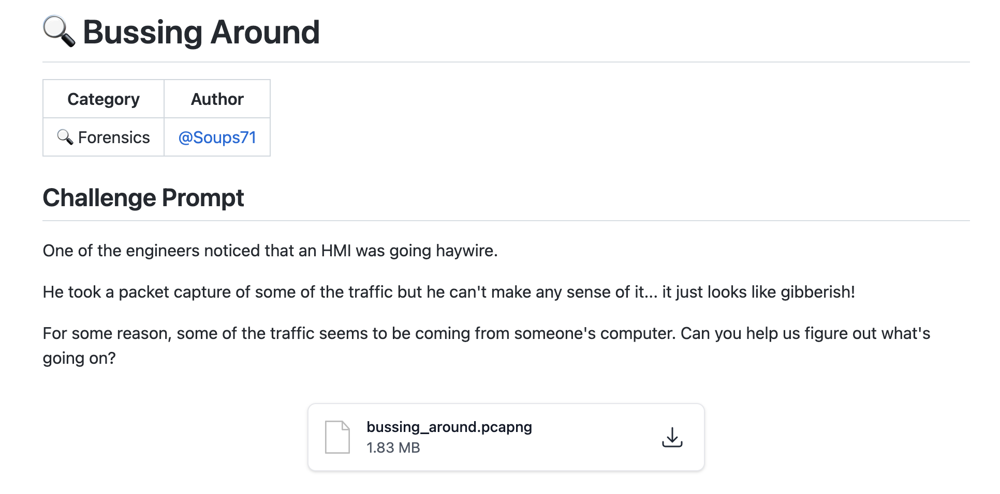
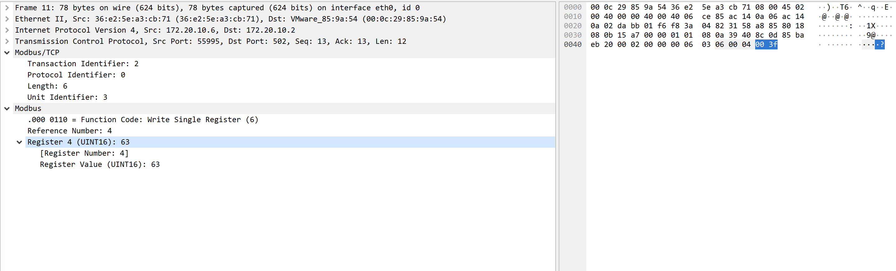
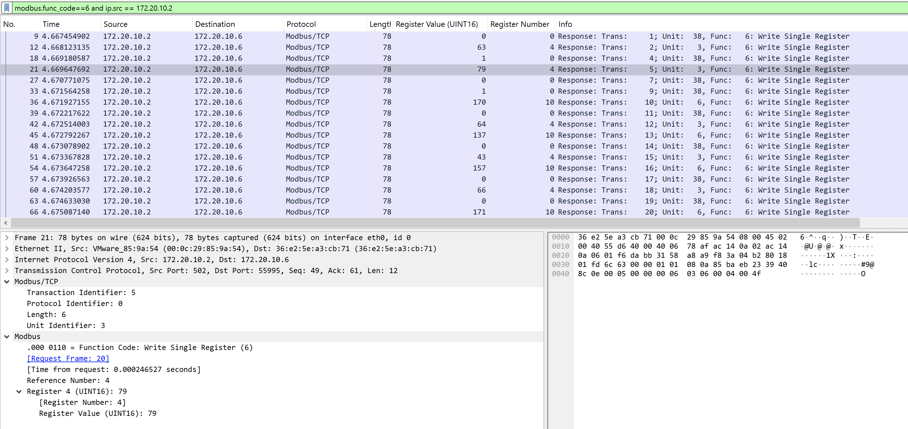

# Huntress CTF 2025 - Bussing around forensics challenge write up

### Overview

| Challenge name | Bussing around |
| --- | --- |
| Solution author | Sudeep Singh |
| Category | Forensics |



In this challenge, we are provided a PCAP file that captured traffic over Modbus protocol between a computer and a PLC. Modbus/TCP is a common communication protocol often used in Industrial Control Systems (ICS). This protocol is also often exploited by threat actors in attacks targeting ICS systems.

Our goal in this challenge is to retrieve the flag.

### Analysis

We begin by quickly checking the conversation statistics and observe the following:
- Most of the communication is between two IP addresses: 172.20.10.6 and 172.20.10.2
- 172.20.10.6 sends the query packets over Modbus/TCP
- 172.20.10.2 sends the response packets over Modbus/TCP
	
Based on this, we can infer that 172.20.10.6 is the computer and 172.20.10.2 is the PLC.

Let us now look at one of the query packets in Wireshark to understand its structure. The screenshot below shows the Modbus query packet structure.



Each packet has a transaction identifier which increments sequentially and is used to pair the query and response packets. Protocol identifier is always 0 and the length of the packet is 6. Unit identifier in Modbus packets is used to uniquely identify the slave device.

The most interesting information here is the value of the register.

There are two key Modbus operations captured in the PCAP
- Write Single Register (func code: 6)
- Write Single Coil (func code: 5)
	
We are specifically interested in Write Single Register operations since the register value changes across packets.

I used the below Wireshark display filter to view only Modbus/TCP packets related to "Write Single Register"
```
modbus.func_code==6
```
Since the same register values are present in both query and response packets, I added the source IP address filter
```
modbus.func_code==6 and ip.src == 172.20.10.2
```
Now, by adding "Register Value (UINT16)" and "Register" as new columns in Wireshark, we get a detailed view of the different register values in each response packet. The screenshot below shows this.



We observe that there are 3 types of registers involved in the write operation:

1. Register 0: Only binary data (0 or 1) is written to it.
2. Register 4: Only values in the range 42 to 80
3. Register 10: Only values in the range 125 to 175

Next, I dumped all the register values specific to each register to a separate file. For such operations, tshark is very useful.

Using the below tshark command line, I extracted all the register values written to register number 0.

```
tshark.exe -r bussing_around.pcapng -Y "modbus.func_code==6 && modbus.reference_num==0 && ip.src==172.20.10.2" -T fields -e modbus.regval_uint16 | powershell -Command "$v = @(); foreach ($line in [Console]::In.ReadToEnd().Split([Environment]::NewLine)) { if ($line.Trim() -ne '') { $v += $line.Trim() } }; ($v -join ',') | Out-File -Encoding ascii reg0.bin"
```

The output looks like below.

```
0,1,0,1,0,0,0,0,0,1,0,0,1,0,1,1,0,0,0,0,0,0,1,1,0,0,0,0,0,1,0,0,0,0,0,0,1,0,1,0,0,0,0,0,0,0,0,0,0,0,0,0,1,0,0,1,0,0,0,0,0,0,0,0,0,0,0,0,0,0,0,0,0,0,0,0,0,0,0,0,1,0,0,0,1,0,1,1,0,1,0,1,0,1,1,0,0,0,1,1,1,0,1,0,0,1,0,1,1,0,1,1,1,0,1,0,1,1,1,1,0,1,0,1
```

This is binary data and we can quickly decode it as shown below.

```python
with open("reg0.bin","r") as f:
	data = f.read()
	
enc = data.split(",")

dec = ""

for i in range(0,len(enc),8):
	_enc = "".join(enc[i:i+8])
	dec += chr(int(_enc,2))

with open("decoded.bin","wb") as f:
	f.write(dec)
```

The output is a password-protected ZIP archive and the password is mentioned in the decoded data.

Once we extract the contents of the password-protected archive, we get the flag inside flag.txt file

flag is: flag{4d2a66c5ed8bb8cd4e4e1ab32c71f7a3}


