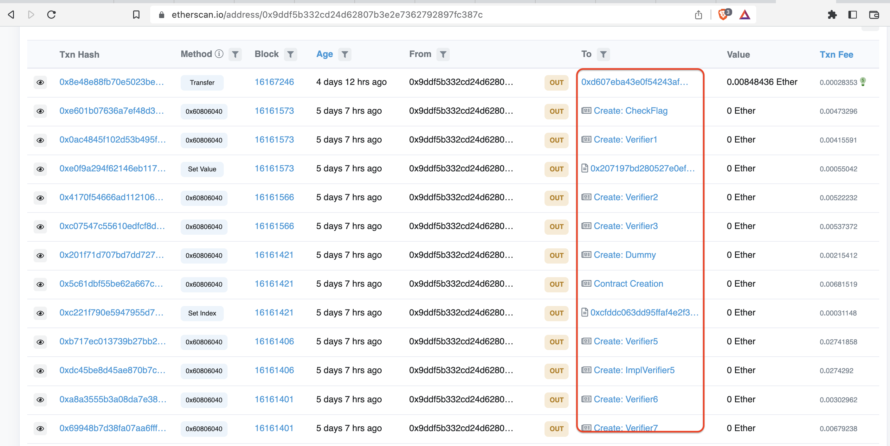
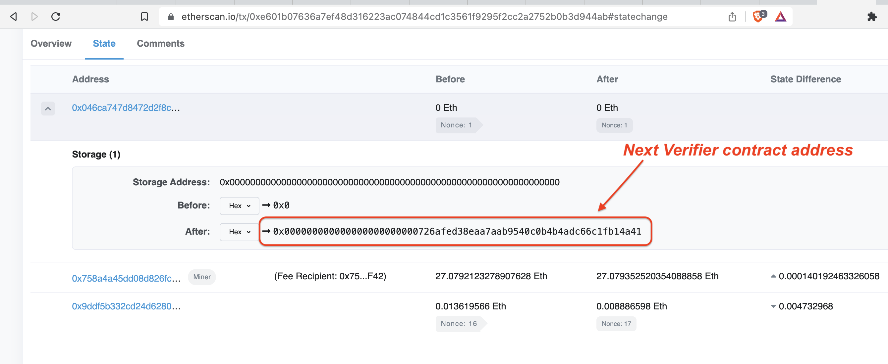
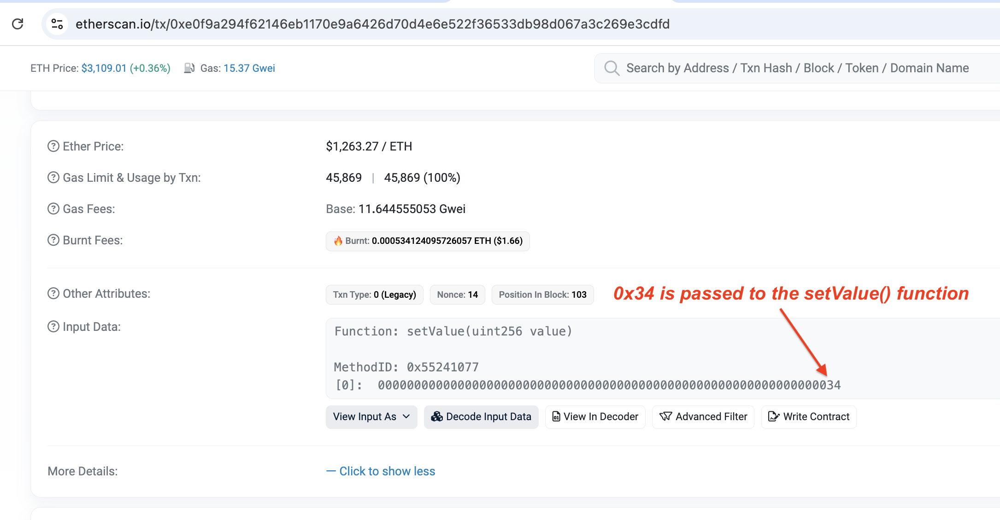
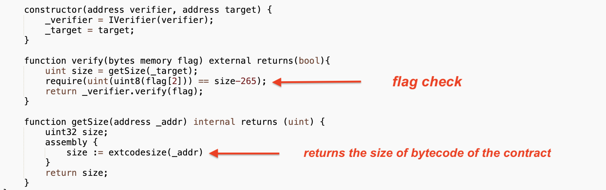
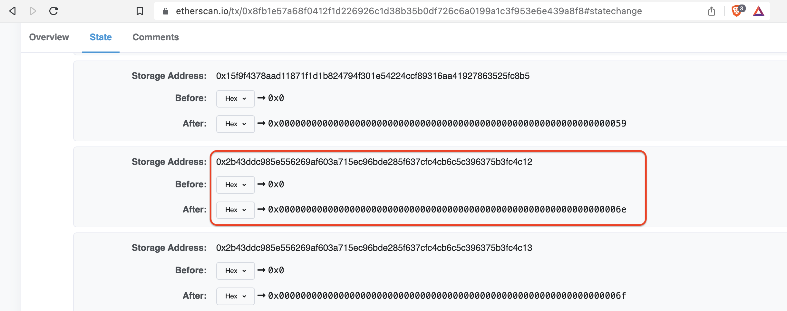

# INTENT CTF 2022 - Blockchain challenge write up

## Summary

Recently, in my free time I participated in the [INTENT CTF](https://intentsummit.org/) organised by [Cyber Ark Solutions](https://www.cyberark.com/)

Among all the challenges I solved, one of them stood out to me because it was a blockchain related challenge. It was refreshing to see a challenge in CTF related to blockchains. In this writeup, I'll discuss how I solved the challenge and also few comments about how I think this challenge could have been made a bit more difficult.

To begin with, we are given an Ethereum smart contract address and the goal is to discover the flag.

Contract address: `0x046ca747d8472d2f8c070655aed06b841215d4b3`

## Initial analysis

We search this contract on etherscan and discover the following main things:

1. Ethereum transaction hash related to creation of this contract: `0xe601b07636a7ef48d316223ac074844cd1c3561f9295f2cc2a2752b0b3d944ab`

Transaction link: https://etherscan.io/tx/0xe601b07636a7ef48d316223ac074844cd1c3561f9295f2cc2a2752b0b3d944ab

2. The EOA with address: `0x9ddf5b332cd24d62807b3e2e7362792897fc387c` was used to create this contract

3. Name of the contract is `CheckFlag` and the source code is available

Based on analysis of the source code, we have following observations:

Function check() defines a few conditions about the format of the flag

- condition #1

```
require(flag.length == 18);
```

This means the flag length should be 18

- condition #2:

```
require(uint256(keccak256(abi.encodePacked(flag[:7], flag[17]))) == 49459084011290387902369587151867275004690538990200813105748590866129266398873);
```

This means the Keccak256 hash of the string concatenated using the first 7 and the last character of the flag should be: `0x6d58d97a386ee471a3357f7561e3659cdd5e5cd80d0b698a0afa88f7a58bd699`

_**Note**_: Keccak256 hash is not the same as SHA256 hash.

With this info, we can confirm that the first 7 characters and the last character of the flag are: `INTENT{}`

So our goal at this point is to discover the remaining 10 characters of the flag which will be present between the curly parentheses.

The return statement in the check() function passes these 10 characters of the flag (flag[7:17]) to the verify method of `_verifier`.

### Identification of Verifier contract addresses

There are two ways to identify all the verifier contract addresses. One of them is more straightforward and works well for this challenge. Another method can even help solve the challenge if it were made more difficult too.

#### Method 1

Per initial analysis of the contract, we know that the EOA with address: `0x9ddf5b332cd24d62807b3e2e7362792897fc387c` was used to create the CheckFlag contract. We can look at the transaction history of this address and see which other contracts were created by it.



Based on this, we can see that this address created several other contracts, namely - Verifier1, Verifier2, Verifier3 and so on

For this challenge, the contracts were named appropriately as each contract was used to decipher one byte of the flag. So, one could analyse the code of all these contracts one by one.

#### Method 2

While Method #1 works well, we can use another method to discover the addresses of each of the verifier contracts.

In each contract, the constructor() is used to initialise the next verifier contract address. To get this contract address, we can check the state of the current contract's creation transaction. Inside the state, we can check the storage slots which will give the verifier contract address.

As an example, for the CheckFlag contract, it initialises the `_verifier` in constructor as shown below

```
IVerifier _verifier;

constructor(address verifier) {
    _verifier = IVerifier(verifier);
}
```

We can check the state of the contract creation transaction as shown below to get the verifier address:



In this specific case, the address of next verifier contract is: 0x726afed38eaa7aab9540c0b4b4adc66c1fb14a41

We can verify on etherscan that it is indeed the Verifier1 contract

https://etherscan.io/address/0x726afed38eaa7aab9540c0b4b4adc66c1fb14a41

So, this method is more generic and will work even if the contracts were not named appropriately. Challenge could have been made more difficult by obfuscating the names of the contracts and creating them in random order.

## Solving flag byte by byte

Now, remaining part of the challenge requires us to analyse each of the verifier contracts and solve them byte by byte.

### Flag[0]

Contract code: https://etherscan.io/address/0x726afed38eaa7aab9540c0b4b4adc66c1fb14a41#code

This one is straightforward.
```
uint value = 0x72;
require(uint(uint8(flag[0])) == value);
```
flag[0] = 'r'

### Flag[1]

Contract code: https://etherscan.io/address/0x207197bd280527e0ef590e46c6bbebb5aef66094#code
```
uint _value;
require(uint(uint8(flag[1])) == _value);
```
But what is `_value`?

There is a setValue() function which is used to set the value of the variable, `_value`.

To find its value, we can check the Ethereum transaction in which this method was invoked.

Ethereum transaction: https://etherscan.io/tx/0xe0f9a294f62146eb1170e9a6426d70d4e6e522f36533db98d067a3c269e3cdfd

Figure below shows the value passed to setValue()



_Note_: This same value can also be fetched by looking at the storage slots in the state of the contract transaction.

flag[1] = "4"

### Flag[2]

Contract code: https://etherscan.io/address/0xaad84ecad496f819f20f06dd6ec34b8d2de270cc#code

Now, challenge becomes more interesting.



size variable is set to the size of the bytecode of the smart contract deployed at address in the `_target` variable.

getSize() function uses inline assembly and leverages the EVM opcode - extcodesize to retrieve the size of the bytecode

By analysing the state of the contract creation transaction, we can find the `_target` contract address


Storage slot 2 holds the address of the next contract

```
_target = 0x9e69f292f83ed4145ed87ea21f55beff37342781

size = extcodesize(_target)
```
We can find the bytecode using etherscan and then calculate the size

Here's the link to the bytecode: https://etherscan.io/bytecode-decompiler?a=0x9e69f292f83ed4145ed87ea21f55beff37342781
length = 726/2 = 363

Now flag condition is:

```
require(uint(uint8(flag[2])) == size-265);
```

flag[2] == 'b'

### Flag[3]

Contract address: https://etherscan.io/address/0x10a29fca0d0661f8bce563eb8bec5e0bcf529101

In this case, the contract code is not available. So, we have to decompile the bytecode and solve it. We can use the Panoramix decompiler to solve this

https://etherscan.io/bytecode-decompiler?a=0x10a29fca0d0661f8bce563eb8bec5e0bcf529101

flag[3] = 'i'

### Flag[4]

Contract code: https://etherscan.io/address/0xcfddc063dd95ffaf4e2f32e6fbc9e49a02dec0ae#code

This one was particularly interesting.

The `verify()` function in this contract uses `delegatecall()` functionality of Solidity to invoke verify function in the implementation contract.

Address of implementation contract is stored in the variable: `_impl`. We can fetch it by checking storage slot 2 in the state of transaction here: https://etherscan.io/tx/0xb717ec013739b27bb269d5ff7a9c74699cab6e8153a7142a05e849bebf927130#statechange

Implementation contract address: `0x2b5f0f6a2492fd99691e6513d96826e263989e21`

Implementation contract code: https://etherscan.io/address/0x2b5f0f6a2492fd99691e6513d96826e263989e21#code

This contract checks the flag using:
```
require(uint(uint8(flag[4])) == values[index+10]);
```
The value of index is set using setIndex()

But here's the important part. The value of index is set to 0 in the calling contract here: https://etherscan.io/tx/0xc221f790e5947955d7b2c94b142639d362821ff2fffe20cb599a386266096320

So, flag checking condition is essentially: `require(uint(uint8(flag[4])) == values[10]);`

Now, we have 2 arrays called value defined. One in implementation contract and the other one in the calling contract.

Which one do we use?

To answer this, we have to understand how delegatecall in Solidity works. In delegatecall, the called contracts inherits the context (storage values) of the calling contract.

So, we have to reference the values array in Verifier5 and not ImplVerifier5 while solving the flag
```
uint[79] public values = [126, 125, 124, 123, 122, 121, 120, 119, 118, 117, 116, 115, 114, 113, 112, 111, 110, 109, 108, 107, 106, 105, 104, 103, 102, 101, 100, 99, 98, 97, 96, 95, 94, 93, 92, 91, 90, 89, 88, 87, 86, 85, 84, 83, 82, 81, 80, 79, 78, 77, 76, 75, 74, 73, 72, 71, 70, 69, 68, 67, 66, 65, 64, 63, 62, 61, 60, 59, 58, 57, 56, 55, 54, 53, 52, 51, 50, 49, 48];
```
values[10] = 116
flag[4] = 't'

### Flag[5]

Contract code: https://etherscan.io/address/0x0c24243f50d67f3e96ac30eb74ece6be8fea8ee1#code

In this case, the flag byte check is done using the following:
```
uint8 value = 0x89 + 0x66;
uint8 mod = 0x74;
value += mod;
require(uint(uint8(flag[5])) == value);
```
value is defined as uint8 and the version of Solidity compiler is defined in pragma as ^0.7.0

value can only hold a maximum value of 0xff. Anything above that results in an integer overflow

value = 0x89 + 0x66 + 0x74

This means, we have an integer overflow!

Solving this, we value = 0x63

flag[5] = 'c'

### Flag[6]

Contract code: https://etherscan.io/address/0xc3b47aa7c213279decd826243f98d25eaf8ffacb#code

In this case, we have an ERC20 token implementation

Verify function checks the flag using following:
```
value = _rhol.totalSupply() / 10**18;
value += _rhol.balanceOf(0xEeeeeEeeeEeEeeEeEeEeeEEEeeeeEeeeeeeeEEeE);
value = value - 1331;
require(uint(uint8(flag[6])) == value);
```
To find the values, we have to check the ERC20 token contract on etherscan. Its address is initialised in the constructor and stored in storage slot 2

https://etherscan.io/tx/0x69948b7d38fa07aa6fff67e31485c6e2d64b422bd14a3f8208290e0507544ded#statechange

RHOL token address = 0x0f117ce0915a7e4afff87f180c87491ce3bf4e49

We can use readContract on etherscan, to call the balanceOf() method and get the balance of 0xEeeeeEeeeEeEeeEeEeEeeEEEeeeeEeeeeeeeEEeE

balance = 42
total supply = 1337

so value = 1337 + 42 - 1331 = 48

flag[6] = '0'

### Flag[7]

Contract code: https://etherscan.io/address/0x639d7b5a3cbc0338660f445e08d961e4bcfbd9c1#code

To solve this challenge, we need to understand how function selectors work and how they are calculated in Solidity.

Flag check condition is:
```
uint value = 0x1F;
require(uint(uint8(flag[7])) == value ^ uint(uint8(msg.data[1])));
```
The first 4 bytes of msg.data correspond to the Keccak256 hash of the function signature of the method invoked. In our case, the method is verify()
```
function signature = keccak256(verify(bytes))[:4] = 8e760afe
msg.data[1] = 0x76
```
flag[7] = 0x1F ^ 0x76 = 0x69
flag[7] = 'i'

### Flag[8]

contract code: https://etherscan.io/address/0xce43f918e590b5a4f47b30574069a94f2473693b#code

In this contract, we have to read a particular storage slot of the contract to get the value of the flag byte
```
uint value;
uint slot;
slot = uint256(keccak256(abi.encode(3326828573661424032217781112562256063166426064292145799638376177296211491616)));

assembly {
	value := sload(slot)
}

require(uint(uint8(flag[8])) == value);
```
Value of storage slot in Solidity can be read using the EVM opcode: sload

The slot in our case is: 19569361961413405628836691222701012584587623737219778909255508772877173017618

So, we'll take the hex value of the slot and look it up in the state of the contract creation transaction

value := sload(0x2b43ddc985e556269af603a715ec96bde285f637cfc4cb6c5c396375b3fc4c12)



value = 0x6e

flag[8] = 'n'

After this, it calls the verify method of the next contract as shown below
```
        _verifier.call(
                abi.encodeWithSignature("verify(bytes )", flag)
        );
```
It is important to note how exactly the verify method in next contract is being called here as it will be used to find the correct flag byte

### Flag[9]

contract code: https://etherscan.io/address/0x44ac5b57c74fc129c10dcbd1d0f6c30e179ced9a#code

In this contract, we have 7 verify methods: verify, verify1, verify2 ... verify6 and one fallback method

Which one of these methods is called?

The previous contract invoked the method using: abi.encodeWithSignature("verify(bytes )", flag)

abi.encodeWithSignature() uses the function selector to call the method. It is important to note that even a single whitespace in the function signature can alter the hash.

The method was invoked using signature of verify(bytes )

Notice the extra whitespace after bytes in above function signature. Due to this, the verify() method won't be called. Instead the function signature will not match any of the functions defined in the contract and invoke the fallback() method
```
    fallback() external {
        bytes memory flag = abi.decode(msg.data[4:], (bytes));
        require(uint(uint8(flag[9])) == 0x35);
    }
```
flag[9] = '5'

Putting all this together, the flag is: INTENT{r4bitc0in5}

## Conclusion

Overall this challenge was fun. It requires understanding of few concepts in Solidity which are important from security point of view as well. Concepts such as delegatecall, integer overflow are very important to understand when auditing Solidity code of smart contracts

Sudeep Singh
