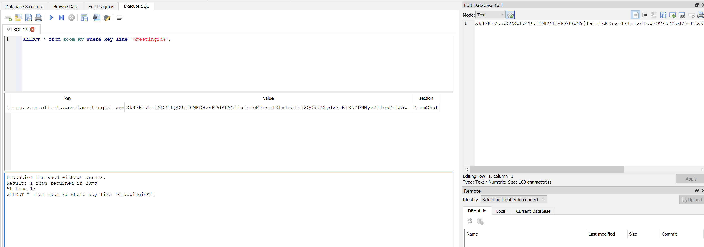
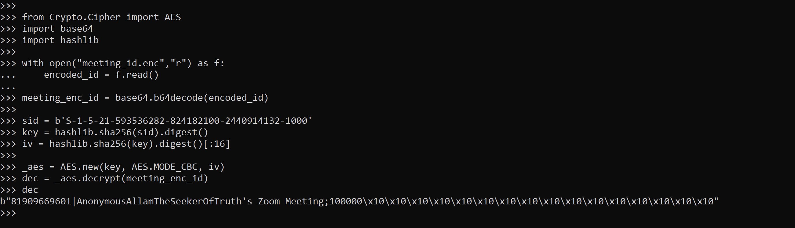

### Overview

| Challenge name | Secret meeting |
| --- | --- |
| Solution author | Sudeep Singh |
| Category | Forensics |

In this challenge, we were provided a Windows machine memory dump and a VSS snapshot.

```
$ tree
.
├── image.001
└── memory.raw

1 directory, 2 files
```

We had to answer 5 questions based on the provided evidence.

At the time of the competition, I solved 3/5 questions. For the two remaining questions, I figured out how to solve later. These two questions remained unsolved by most of the teams. I will also discuss why it was difficult to answer one of the questions because it involved a particular limitation in forensics tools like volatility3 and MemProcFs.

### Initial analysis

The image.001 file provided to us contains a volume shadow snapshot. We can confirm this by running the vshadowinfo command on the provided disk image.
```
└─$ vshadowinfo image.001

vshadowinfo 20240504

Volume Shadow Snapshot information:
        Number of stores:       1

Store: 1
        Identifier              : f81bf84d-fa9e-11ef-8f9d-000c298d92b2
        Shadow copy set ID      : b3e9e78b-3da9-4ae5-91ea-3db1dad43397
        Creation time           : Mar 06, 2025 17:17:33.137201600 UTC
        Shadow copy ID          : 7c40dfd6-823d-47d3-bc02-810b59246550
        Volume size             : 2.0 GiB (2202009600 bytes)
        Attribute flags         : 0x0002001d
```

I mounted this disk using below commands.

```
sudo vshadowmount -X allow_other image.001 /mnt/vss
sudo mount -o ro,loop /mnt/vss/vss1 /mnt/shadow1
```

Browsing the AppData\Roaming directory of the user `a1l4m`, we can confirm the presence of Zoom application on the machine

```
└─$ ls -al /mnt/shadow1/Users/a1l4m/AppData/Roaming/                  
total 8
drwxrwxrwx 1 root root    0 Mar  6  2025 .
drwxrwxrwx 1 root root    0 Mar  6  2025 ..
drwxrwxrwx 1 root root    0 Mar  6  2025 Adobe
drwxrwxrwx 1 root root 4096 Mar  6  2025 Microsoft
drwxrwxrwx 1 root root 4096 Mar  6  2025 Zoom
```

With this initial analysis, we can begin answering the remaining questions.

#### Question 1

When was the private communications application installed? Provide the exact installation timestamp in UTC (YYYY-MM-DD HH:MM:SS)

#### Answer

Since we already identified the presence of Zoom application on the machine, we can use reglookup to identify the installation timestamp from Windows registry. NTUSER.DAT will have this information.

```
└─$ reglookup -p /SOFTWARE/Microsoft/Windows/CurrentVersion/Uninstall/ /mnt/shadow1/Users/a1l4m/NTUSER.DAT 
PATH,TYPE,VALUE,MTIME
/SOFTWARE/Microsoft/Windows/CurrentVersion/Uninstall,KEY,,2024-12-17 08:51:01
/SOFTWARE/Microsoft/Windows/CurrentVersion/Uninstall/ZoomUMX,KEY,,2024-12-17 08:51:01
```

So the timestamp is: `2024-12-17 08:51:01`

#### Question 2

It seems Khalid took steps to cover his tracks. A forensic review of the system reveals he used a tool specifically designed to erase digital evidence. What tool did he use?

#### Answer

There are a few popular tools used by threat actors in-the-wild to erase evidence on a machine. One of them is sdelete.

The strings output shows this

```
└─$ strings memory.raw| grep -i sdelete.exe
\Device\HarddiskVolume3\Program Files\SysinternalsSuite\sdelete.exe
```

Answer is: sdelete

#### Question 3

Investigators located a previous system snapshot of Khalid's machine, preserving data before his deletion attempt. When was this snapshot saved? Provide the exact timestamp in UTC.

#### Answer

Since the provided disk image contains a volume shadow snapshot, we can get this information using `vshadowinfo` as shown below.

```
└─$ vshadowinfo image.001

vshadowinfo 20240504

Volume Shadow Snapshot information:
        Number of stores:       1

Store: 1
...
        Creation time           : Mar 06, 2025 17:17:33.137201600 UTC
...
```

Answer is: 2025-03-06 17:17:33

#### Question 4

What is the meeting ID for Khalid's meeting?

#### Answer

Zoom application stores details of the meetings attended by the user in a SQLite database in the user's AppData directory. However, this database is encrypted. Below is the location of the AppData directory containing the encrypted SQLite database and the corresponding decryption key.

```
└─$ ls -al /mnt/shadow1/Users/a1l4m/AppData/Roaming/Zoom/data 
total 126
drwxrwxrwx 1 root root   4096 Mar  6  2025  .
drwxrwxrwx 1 root root   4096 Mar  6  2025  ..
-rwxrwxrwx 1 root root   4096 Mar  6  2025 '$I30'
-rwxrwxrwx 1 root root    197 Mar  6  2025  client.config
drwxrwxrwx 1 root root      0 Mar  6  2025  ConfAvatar
drwxrwxrwx 1 root root      0 Mar  6  2025  noauth_marketing_dialog
-rwxrwxrwx 1 root root    328 Mar  6  2025  viper.ini
drwxrwxrwx 1 root root      0 Mar  6  2025  WaitingRoom
-rwxrwxrwx 1 root root      0 Dec 17  2024  zmonitorlog.bin
drwxrwxrwx 1 root root      0 Dec 17  2024  ZoomAppIcon
-rwxrwxrwx 1 root root 112640 Mar  6  2025  zoomus.enc.db
-rwxrwxrwx 1 root root    460 Mar  6  2025  Zoom.us.ini
```

zoomus.enc.db is the encrypted SQLite database. The file, Zoom.us.ini contains the decryption key as shown below.

```
└─$ cat /mnt/shadow1/Users/a1l4m/AppData/Roaming/Zoom/data/Zoom.us.ini
[ZoomChat]
win_osencrypt_key=ZWOSKEYAQAAANCMnd8BFdERjHoAwE/Cl+sBAAAAwObo0paxzki082CkyZq39AAAAAACAAAAAAAQZgAAAAEAACAAAAAgiwjfVydymRvMysPHL6DaJMt/bAG48bLjMImUBjGtOAAAAAAOgAAAAAIAACAAAADTYbjWu97HyS1DR/dhnUvZtHEpSdqrIelsKECMqy+3uDAAAAALIiQUC80rTMfNrX2yxIEmvIzqnkSkvXGilH0Rs/T20oGBEvR2vfhCieSlN0MW7PBAAAAAWl7zydPpAPt3zBI0WPbMTilBiqv4G6zPN53YL5Dv5BJr9YtHg/PeNOUClPfgkN3mG4WLRkuE3if9RPwaD5uoLw==
com.zoom.client.langid=1033
com.disable.connection.pk.status=false
```

The key, `win_osencrypt_key` is further protected by Microsoft DPAPI. We can locate the DPAPI masterkeys on the machine in below location.

```
└─$ ls -al /mnt/shadow1/Users/a1l4m/AppData/Roaming/Microsoft/Protect/S-1-5-21-593536282-824182100-2440914132-1000 
total 6
drwxrwxrwx 1 root root    0 Mar  6  2025  .
drwxrwxrwx 1 root root    0 Mar  6  2025  ..
-rwxrwxrwx 1 root root 4096 Dec 17  2024 '$I30'
-rwxrwxrwx 1 root root  468 Dec 17  2024  b933b619-b210-4cf4-b338-2d0a2516f7b3
-rwxrwxrwx 1 root root  468 Dec 17  2024  d2e8e6c0-b196-48ce-b4f3-60a4c99ab7f4
-rwxrwxrwx 1 root root   24 Dec 17  2024  Preferred
```

There are two DPAPI masterkeys and these are encrypted as well. Before we decrypt them, we also need to understand which masterkey was used to encrypt the Zoom key, `win_osencrypt_key`

We can do it as shown below.

1. Remove the 'ZWOSKEY' header from the key, win_osencrypt_key
2. Base64-decode it
```
echo -n "AQAAANCMnd8BFdERjHoAwE/Cl+sBAAAAwObo0paxzki082CkyZq39AAAAAACAAAAAAAQZgAAAAEAACAAAAAgiwjfVydymRvMysPHL6DaJMt/bAG48bLjMImUBjGtOAAAAAAOgAAAAAIAACAAAADTYbjWu97HyS1DR/dhnUvZtHEpSdqrIelsKECMqy+3uDAAAAALIiQUC80rTMfNrX2yxIEmvIzqnkSkvXGilH0Rs/T20oGBEvR2vfhCieSlN0MW7PBAAAAAWl7zydPpAPt3zBI0WPbMTilBiqv4G6zPN53YL5Dv5BJr9YtHg/PeNOUClPfgkN3mG4WLRkuE3if9RPwaD5uoLw==" | base64 -d > zoom_enc.key
```
3. Using mimikatz, we can analyse this blob to identify the DPAPI key used to encrypt it.

```
mimikatz # dpapi::blob /in:zoom_enc.key
**BLOB**
  dwVersion          : 00000001 - 1
  guidProvider       : {df9d8cd0-1501-11d1-8c7a-00c04fc297eb}
  dwMasterKeyVersion : 00000001 - 1
  guidMasterKey      : {d2e8e6c0-b196-48ce-b4f3-60a4c99ab7f4}
  dwFlags            : 00000000 - 0 ()
  dwDescriptionLen   : 00000002 - 2
  szDescription      :
  algCrypt           : 00006610 - 26128 (CALG_AES_256)
```

So the DPAPI key, `d2e8e6c0-b196-48ce-b4f3-60a4c99ab7f4` was used to encrypt the Zoom key.

In order to decrypt the DPAPI key, we can use several methods. We can get the NT hash of the user as follows.

```
└─$ vol -f memory.raw windows.registry.hashdump.Hashdump
Volatility 3 Framework 2.27.0
Progress:  100.00               PDB scanning finished                        
User    rid     lmhash  nthash

Administrator   500     aad3b435b51404eeaad3b435b51404ee        31d6cfe0d16ae931b73c59d7e0c089c0
Guest   501     aad3b435b51404eeaad3b435b51404ee        31d6cfe0d16ae931b73c59d7e0c089c0
DefaultAccount  503     aad3b435b51404eeaad3b435b51404ee        31d6cfe0d16ae931b73c59d7e0c089c0
WDAGUtilityAccount      504     aad3b435b51404eeaad3b435b51404ee        e3c2f08a11a941cdb271bb291474d7a1
a1l4m   1000    aad3b435b51404eeaad3b435b51404ee        c8e9430ee9a1f04828e2214ed538c20b
```

Even though we have the NT hash of the user as `c8e9430ee9a1f04828e2214ed538c20b`, this could not be used to decrypt the DPAPI masterkey. This is what increased the difficulty of the challenge.

We could try dumping the lsass.exe process using volatility3 but it does not dump it in the minidump format. Due to that, we could not use pypykatz or mimikatz on the dumped lsass.exe process.

### MemProcFs to generate LSASS minidump

We could use MemProcFs to dump the lsass.exe process and then extract the decrypted DPAPI masterkeys from it. However, there is an important thing to note about MemProcFs limitations to do this.

In version 5.8.20, MemProcFs added a GitHub commit here: https://github.com/ufrisk/MemProcFS/blob/d53177c58b52b74fb37d7ce9e18f1f3000f9d5d3/vmm/modules/m_proc_minidump.c to add a check for lsass.exe process which prevents the minidump from being generated due to security reasons.

There are two options to make MemProcFs work in such a way that it provides us the minidump of lsass.exe process.

Option 1

Patch the source code and build MemProcFs from source. We need to patch the below check in `m_proc_minidump.c`

```
    // ensure the generated file is ok security wise:
    if(!strcmp(pProcess->szName, "lsass.exe")) {
        ctx->fDisabledSecurity = TRUE;
    }
```

Option 2

We can use a MemProcFs version older than 5.8.20 to access the minidump of lsass.exe process.

We can mount the provided memory dump as a filesystem using below command
```
memprocfs.exe -device memory.raw
```

The minidump can be accessed in the path, `/pid/704/minidump/` where 704 is the PID of lsass.exe process

We can use mimikatz to extract the decrypted masterkey from this minidump.

```
mimikatz # sekurlsa::minidump minidump.dmp
Switch to MINIDUMP : 'minidump.dmp'

mimikatz # sekurlsa::logonpasswords
Opening : 'minidump.dmp' file for minidump...

Authentication Id : 0 ; 113691 (00000000:0001bc1b)
Session           : Interactive from 1
User Name         : a1l4m
Domain            : WIN-NP10IHJMV3O
Logon Server      : WIN-NP10IHJMV3O
Logon Time        : 3/6/2025 9:28:40 AM
SID               : S-1-5-21-593536282-824182100-2440914132-1000
....

mimikatz # sekurlsa::dpapi

Authentication Id : 0 ; 113691 (00000000:0001bc1b)
Session           : Interactive from 1
User Name         : a1l4m
Domain            : WIN-NP10IHJMV3O
Logon Server      : WIN-NP10IHJMV3O
Logon Time        : 3/6/2025 9:28:40 AM
SID               : S-1-5-21-593536282-824182100-2440914132-1000
         [00000000]
         * GUID      :  {d2e8e6c0-b196-48ce-b4f3-60a4c99ab7f4}
         * Time      :  3/6/2025 9:30:41 AM
         * MasterKey :  c1536fcb9e1bbde82e2335d5900814235140832db25bdbc1be6429fe56bc1acd894f79c41ae8c4f6aef73c4ab2df63a398b0014ff63de5f076857a683754ca44
         * sha1(key) :  31b0fdc86ecde31187c0fc062f1fad55c47e731b
         [00000001]
         * GUID      :  {b933b619-b210-4cf4-b338-2d0a2516f7b3}
         * Time      :  3/6/2025 9:29:29 AM
         * MasterKey :  145943de35246eeee88c8c690c006f965bcce2be27a0a6101b327b363aabbec36d912efa3c050767c514e0a9beee85a70e431f01e3bc681f5f7a99a496555259
         * sha1(key) :  5da4e95183ae8a717211ee48a3c9acced55952d7
...
```

So c1536fcb9e1bbde82e2335d5900814235140832db25bdbc1be6429fe56bc1acd894f79c41ae8c4f6aef73c4ab2df63a398b0014ff63de5f076857a683754ca44 is the decrypted masterkey that can be used to decrypt the Zoom key.

```
mimikatz # dpapi::blob /in:zoom_dpapi.dat /masterkey:c1536fcb9e1bbde82e2335d5900814235140832db25bdbc1be6429fe56bc1acd894f79c41ae8c4f6aef73c4ab2df63a398b0014ff63de5f076857a683754ca44
**BLOB**
  dwVersion          : 00000001 - 1
  guidProvider       : {df9d8cd0-1501-11d1-8c7a-00c04fc297eb}
  dwMasterKeyVersion : 00000001 - 1
  guidMasterKey      : {d2e8e6c0-b196-48ce-b4f3-60a4c99ab7f4}
  dwFlags            : 00000000 - 0 ()
  dwDescriptionLen   : 00000002 - 2
  szDescription      :
  algCrypt           : 00006610 - 26128 (CALG_AES_256)
  dwAlgCryptLen      : 00000100 - 256
  dwSaltLen          : 00000020 - 32
  pbSalt             : 208b08df572772991bcccac3c72fa0da24cb7f6c01b8f1b2e33089940631ad38
  dwHmacKeyLen       : 00000000 - 0
  pbHmackKey         :
  algHash            : 0000800e - 32782 (CALG_SHA_512)
  dwAlgHashLen       : 00000200 - 512
  dwHmac2KeyLen      : 00000020 - 32
  pbHmack2Key        : d361b8d6bbdec7c92d4347f7619d4bd9b4712949daab21e96c28408cab2fb7b8
  dwDataLen          : 00000030 - 48
  pbData             : 0b2224140bcd2b4cc7cdad7db2c48126bc8cea9e44a4bd71a2947d11b3f4f6d2818112f476bdf84289e4a5374316ecf0
  dwSignLen          : 00000040 - 64
  pbSign             : 5a5ef3c9d3e900fb77cc123458f6cc4e29418aabf81baccf379dd82f90efe4126bf58b4783f3de34e50294f7e090dde61b858b464b84de27fd44fc1a0f9ba82f

 * volatile cache: GUID:{d2e8e6c0-b196-48ce-b4f3-60a4c99ab7f4};KeyHash:31b0fdc86ecde31187c0fc062f1fad55c47e731b;Key:available
 * masterkey     : c1536fcb9e1bbde82e2335d5900814235140832db25bdbc1be6429fe56bc1acd894f79c41ae8c4f6aef73c4ab2df63a398b0014ff63de5f076857a683754ca44
description :
data: 44 34 51 51 59 54 66 6a 52 62 43 42 69 38 49 47 78 5a 67 65 77 37 38 6d 2b 4e 56 6c 4f 2f 35 58 58 43 74 6d 79 41 4e 64 41 57 63 3d
```

We can extract the data field and hex-decode it to get the Base64-encoded string

```
>>> bytes.fromhex("44 34 51 51 59 54 66 6a 52 62 43 42 69 38 49 47 78 5a 67 65 77 37 38 6d 2b 4e 56 6c 4f 2f 35 58 58 43 74 6d 79 41 4e 64 41 57 63\
 3d".replace(" ",""))
b'D4QQYTfjRbCBi8IGxZgew78m+NVlO/5XXCtmyANdAWc='
```

Now we can open the encrypted SQLite DB, zoom.enc.db with SQLite Cipher and use the above Base64-encoded key to decrypt it. The meeting ID is stored encrypted in the zoom_kv table as shown below.



```
com.zoom.client.saved.meetingid.enc=Xk47KrVoeJZC2bLQCUc1EMKOHzVRPdB6M9jlainfcM2rsrI9fxlxJIeJ2QC95ZZydVSrBfX57DMNyvZ11cw2gLAYac/5wldVpzLyNdbsQvg=
```

Meeting id in Zoom database is encrypted using the AES algorithm in CBC mode. The key is derived from the SHA256 hash of the user's SID and the IV is derived from the SHA256 hash of the key.

We can decrypt as shown below.



So the meeting id is: 81909669601

#### Question 5

How long did Khalid remain in the meeting? Provide the duration in seconds.

#### Answer

We can find the ActivitiesCache.db in the user's AppData directory

```
└─$ ls -al /mnt/shadow1/Users/a1l4m/AppData/Local/ConnectedDevicesPlatform/L.a1l4m
total 1996
drwxrwxrwx 1 root root       0 Mar  6  2025  .
drwxrwxrwx 1 root root    4096 Mar  6  2025  ..
-rwxrwxrwx 1 root root    4096 Nov  7  2024 '$I30'
-rwxrwxrwx 1 root root       0 Mar  6  2025  ACTIVI~2.DB-
-rwxrwxrwx 1 root root  180224 Dec  9  2024  ActivitiesCache.db
-rwxrwxrwx 1 root root   32768 Mar  6  2025  ActivitiesCache.db-shm
-rwxrwxrwx 1 root root 1821072 Mar  6  2025  ActivitiesCache.db-wal
```

This is a SQLite database and we can find the duration of Zoom meetings attended by the user in this DB.

```
└─$ sqlite3 /mnt/shadow1/Users/a1l4m/AppData/Local/ConnectedDevicesPlatform/L.a1l4m/ActivitiesCache.db
SQLite version 3.46.1 2024-08-13 09:16:08
Enter ".help" for usage hints.
sqlite> SELECT AppId, StartTime, EndTime
FROM Activity
WHERE AppId LIKE '%Zoom%';
[{"application":"zoom.us.Zoom Video Meetings","platform":"windows_win32"},{"application":"zoom.us.Zoom Video Meetings","platform":"packageId"},{"application":"","platform":"alternateId"}]|1741274698|0
[{"application":"zoom.us.Zoom Video Meetings","platform":"windows_win32"},{"application":"zoom.us.Zoom Video Meetings","platform":"packageId"},{"application":"","platform":"alternateId"}]|1741274698|1741275093
[{"application":"zoom.us.Zoom Video Meetings","platform":"windows_win32"},{"application":"zoom.us.Zoom Video Meetings","platform":"packageId"},{"application":"","platform":"alternateId"}]|1741274780|1741274803
[{"application":"zoom.us.Zoom Video Meetings","platform":"windows_win32"},{"application":"zoom.us.Zoom Video Meetings","platform":"packageId"},{"application":"","platform":"alternateId"}]|1741274803|1741274808
[{"application":"zoom.us.Zoom Video Meetings","platform":"windows_win32"},{"application":"zoom.us.Zoom Video Meetings","platform":"packageId"},{"application":"","platform":"alternateId"}]|1741274808|1741275089
sqlite> 
```

The most recent entry gives us
Start time = 1741274808
End time = 1741275089
Duration = 281 seconds
