## Cyber Threat 2024 Disassembly Dilemma challenge solution

| Challenge name | Disassembly Dilemma |
| --- | --- |
| Author | Sudeep Singh |
| Category | Reverse engineering |

## Summary

Disassembly dilemma was one of the challenges prepared by SANS for their upcoming Cyber Threat 2024 conference. SANS Cyber Threat website categorized this challenge as "hard" and they offered a 75% discount for the Cyber Threat 2024 conference ticket to anyone who solved this challenge.


In this challenge, we are provided a Windows 32-bit binary that accepts a key as an input. The goal of this challenge is to retrieve the flag by providing correct input to the binary.

- **Download link**: https://cyberthreat.io/challenges/c4-challenge.zip

- MD5 hash: 0746eb07adaedd7375ed649083c665ab
- SHA1 hash: 43245701da2cd7756eb90d39210bcf934fc17bfe
- SHA256 hash: 88cd41ad4454df977bf565153ca1b2bd0af8927da356e5d9df02896e81f8afad
- Filename: ct24.exe

## Solution 

We are given a 32-bit binary with an x86 instruction set. Upon execution, the binary expects an input in the following format and it will display the flag upon receiving correct input.

Input format: XXXX-XXXX-XXXX-XXXX


TLDR; The binary uses anti-disassembly techniques to confuse disassemblers like IDA Pro. The disassembly technique is used numerous times in the binary in order to deter reverse engineering and prevent understanding the code. In order to solve this challenge, the idea is to filter the noise, trace the input, extract the constraints and then use an SMT solver like Z3 to find the correct input that prints the flag.

### Reading the input 

It uses `gets_s()` to read the input into the buffer at address [ebp-44]

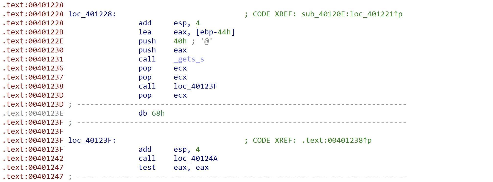

### Anti-disassembly techniques
 
The main technique used in this binary to make the process of reversing more difficult is the usage of anti-disassembly techniques. 

The image below shows an example of the anti-disassembly.

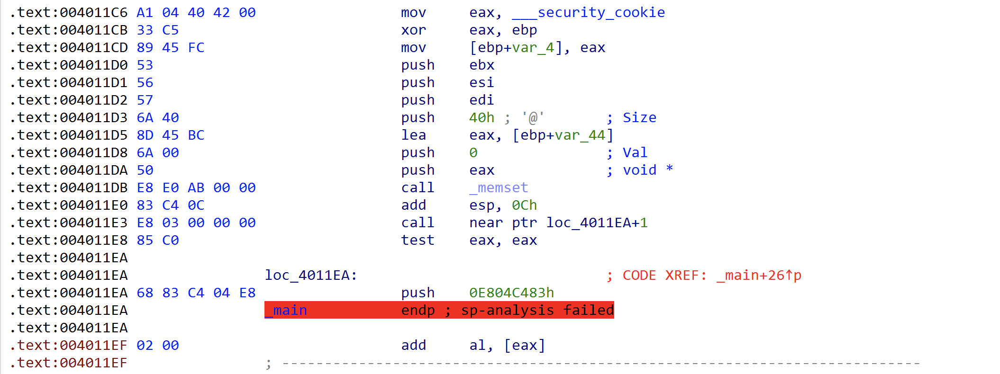

In the above code section, the CALL instruction at address: `004011E3` transfers the control to the address `4011EA+1`; however disassemblers like IDA Pro will disassemble the bytes at address `4011EA` resulting in incorrect disassembly. This is achieved by adding the opcode for PUSH instruction (0x68) after the CALL instruction and before the CALL target address. Since IDA Pro recognises 0x68 as a valid opcode for the PUSH instruction, it begins disassembling there instead of beginning disassembling at the CALL target address.

This same technique is used in multiple locations in the binary. I fixed all these code sections in IDA Pro to make the analysis more easy.

A quick way to fix the disassembly would be to first tell IDA Pro to interpret the bytes at address `4011EA` as data instead of code. Then tell IDA pro to interpret the bytes at address `4011EA+1` as code. After applying this logic to the above code section, we can see the correct disassembly as shown in the image below.

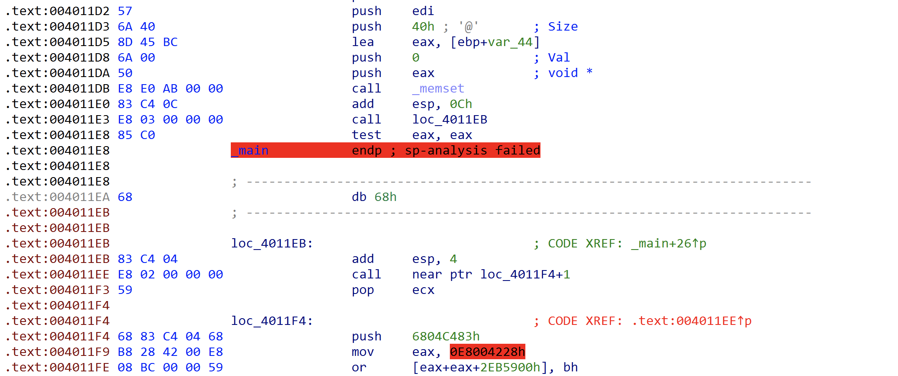

We can now see the correct disassembled code at address `4011EB` however we can again see the same anti-disassembly technique applied at address `4011EE`. In order to get the correct disassembled code, the first step should be to fix all these code sections and then analyze the code to see how it processes the input.

## Identifying the constraints

After analyzing the code, we can see that the binary checks to ensure that the input satisfies certain constraints. These constraints will later be used to find the solution.
 
There are 4 main constraints, each corresponding to the group of 4 characters of the input.

### Constraint 1 

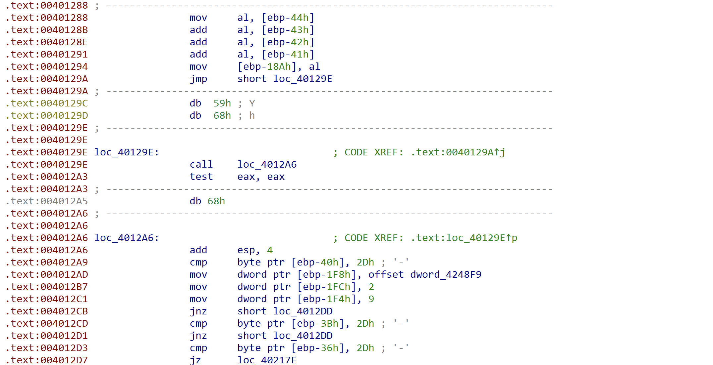
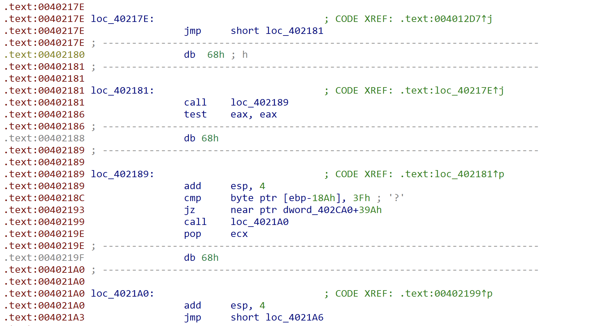

The above constraint ensures that the sum of the first 4 bytes of the input is equal to 0x3f 

At a high-level we can represent it as:
```
(x1 + x2 + x3 + x4) == 0x3f
```
Here each of x1, x2, x3, and x4 are 8-bit integers. 

### Constraint 2

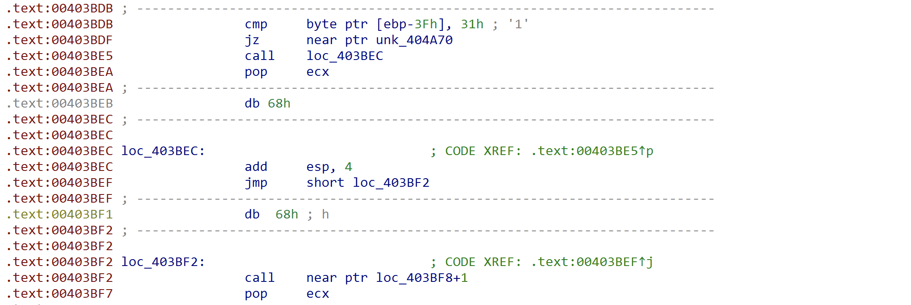
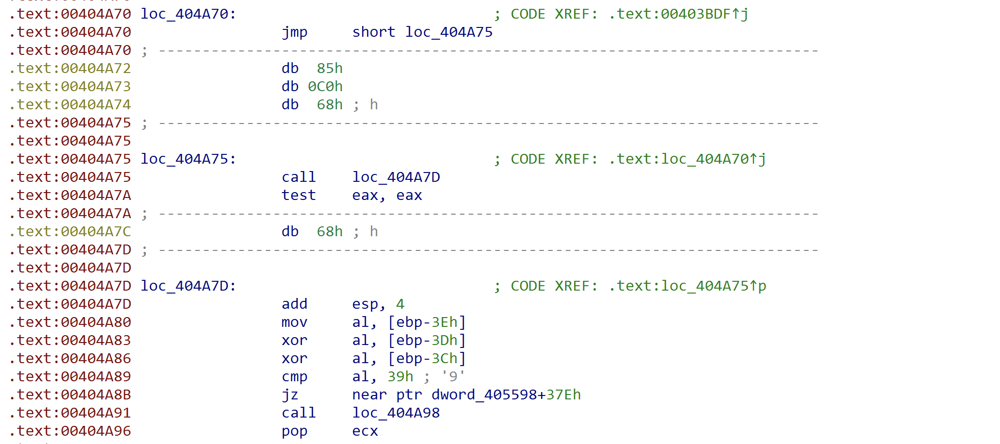

The above constraint checks if the byte at offset 5 is equal to 0x31. It then checks whether the result of XOR operation of bytes at offsets 6, 7 and 8 is 0x39 

At a high-level, we can define these constraints as:
```
x1 = 0x31 
(x2 ^ x3 ^ x4 == 0x39)
```

### Constraint 3 

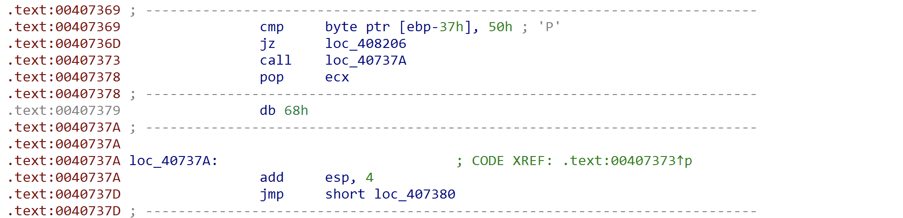
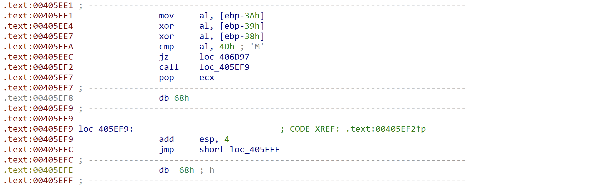

This next constraint ensures that the result of XOR operation of bytes at offset 10, 11 and 12 is equal to 0x4D 

At a high-level, this constraint can be represented as:
```
x1 ^ x2 ^ x3 == 0x4d 
x4 = 0x50
```

### Constraint 4 

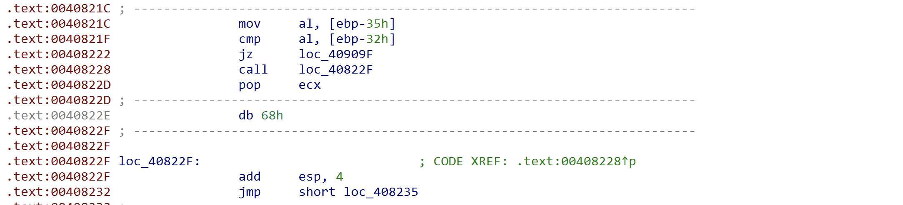
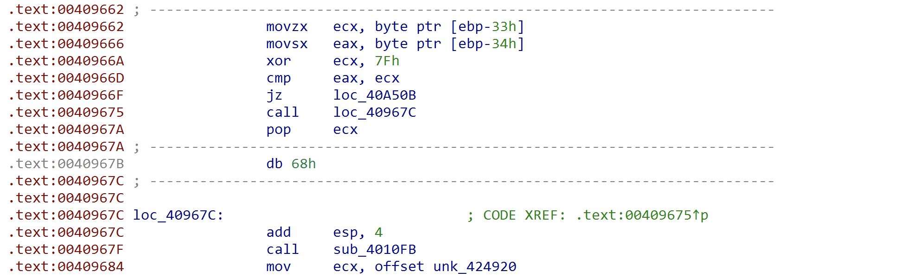

The above constraint checks that the bytes at offsets 15 and 18 are equal to each other. It also checks that the result of XOR operation of byte at offset 17 with 0x7f is equal to the byte at offset 16.
 
At a high-level, this can be represented by
```
x1 == x4
x2 ^ 0x7f = x3
```

The solution therefore is to solve for the above constraints. I used the theorem prover - Z3 to solve for the above constraints.

There are multiple possible inputs that satisfy the above constraints. I used the following input in order to get the flag. Flag will be decrypted at runtime by the binary when the below input is provided. 

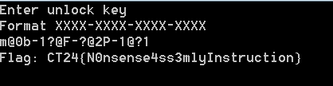

- **Input**: m@0b-1?@F-?@2P-1@?1
- **Flag**: CT24{N0nsense4ss3mlyInstruction}

## Solution script

Below is the z3 script I wrote in order to solve this challenge

```python
from z3 import *

# Create solver instance
solver = Solver()

# Define 16 8-bit variables for the 16 characters
x = [BitVec(f"x{i}", 8) for i in range(16)]

# ASCII characters are between 0x20 (32) and 0x7E (126)
for i in range(len(x)):
    solver.add(x[i] >= 0x20, x[i] <= 0x7e)

'''
Constraint 1
The sum of the four characters must be 0x3F
'''
solver.add(x[0] + x[1] + x[2] + x[3] == 0x3F)
'''
Constraint 2
'''
solver.add(x[4] == 0x31)
solver.add(x[5] ^ x[6] ^ x[7] == 0x39)
'''
Constraint 3
'''
solver.add(x[8] ^ x[9] ^ x[10] == 0x4d)
solver.add(x[11] == 0x50)
'''
Constraint 4
'''
solver.add(x[12] == x[15])
solver.add(x[13] ^ 0x7f == x[14])

# Function to exclude a specific solution
def exclude_solution(solver, model, variables):
    return Or([var != model[var] for var in variables])

# Variables to store solutions
solutions = []

# Iteratively find all solutions
while solver.check() == sat:
    model = solver.model()
    solution = []
    for i in range(16):
        solution.append(model[x[i]].as_long())
    solution_str = ""
    for i in range(len(solution)):
        if i % 4 == 0 and i!= 0:
            solution_str += "-" + chr(solution[i])
        else:
            solution_str += chr(solution[i])
    print(solution_str)
    solutions.append(solution)
    
    # Exclude this solution from the next iteration
    solver.add(exclude_solution(solver, model, [x[0], x[1], x[2], x[3]]))

# Print all solutions
print("All Solutions:")
for sol in solutions:
    print(sol)
```
