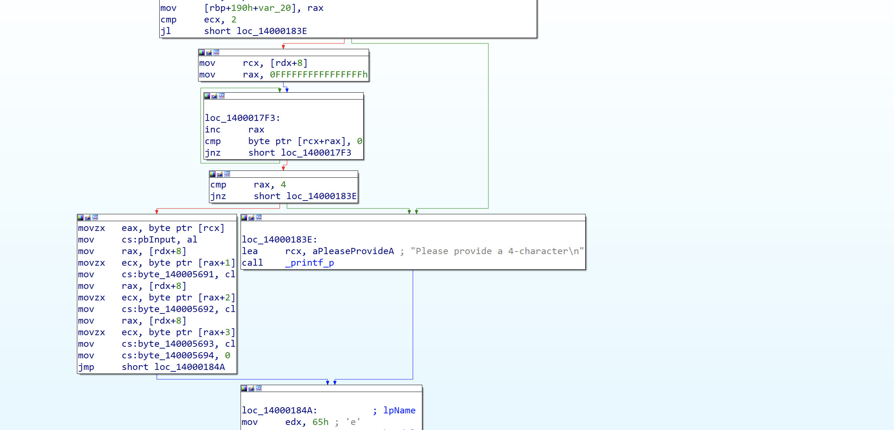
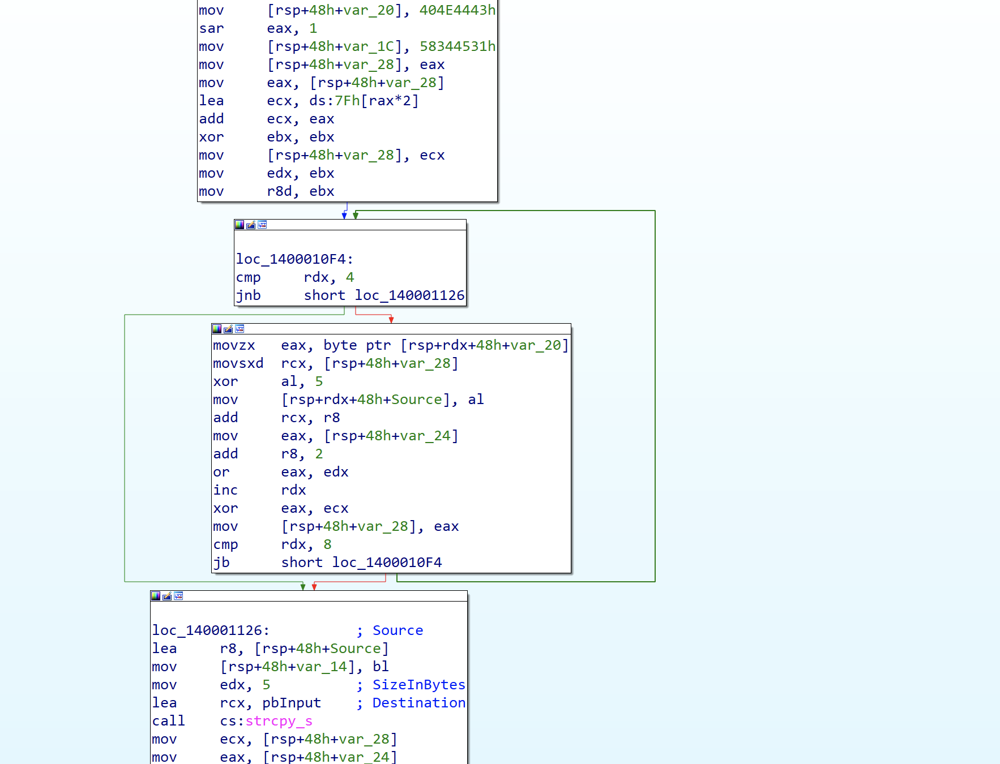
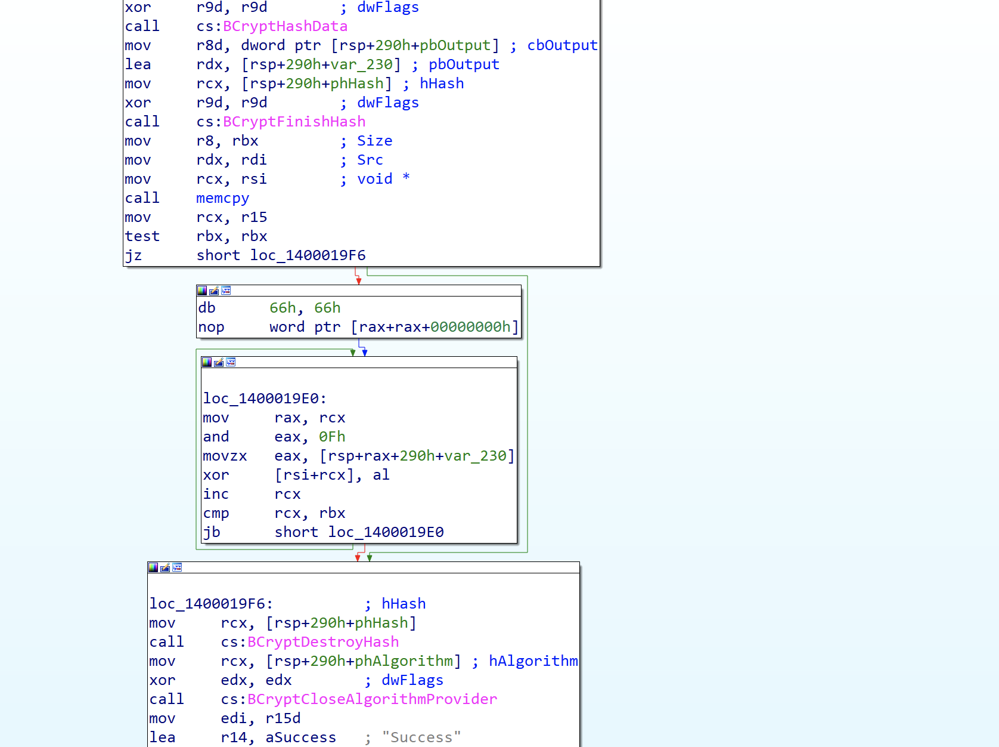
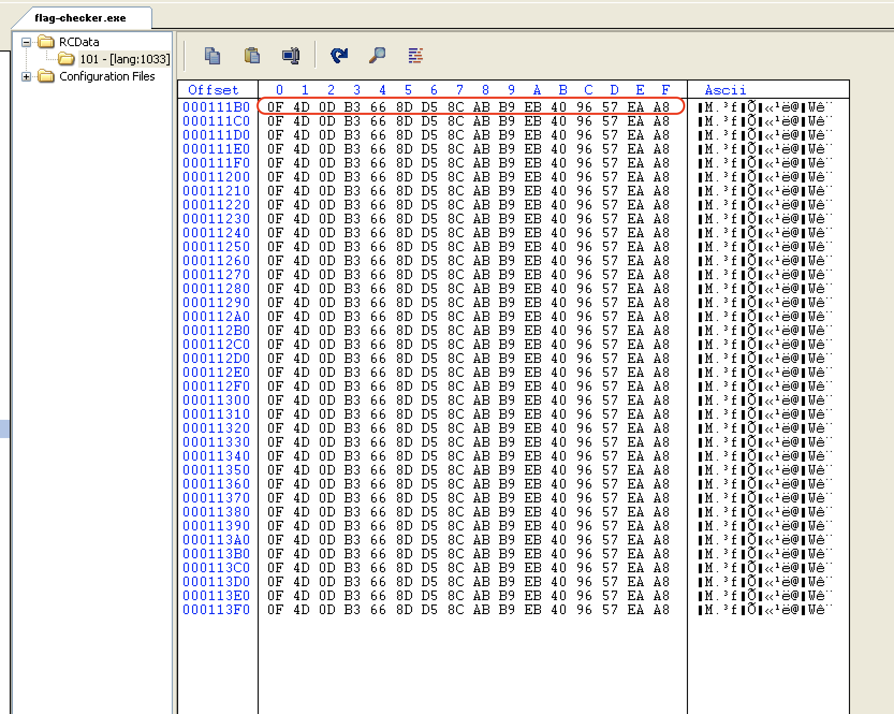
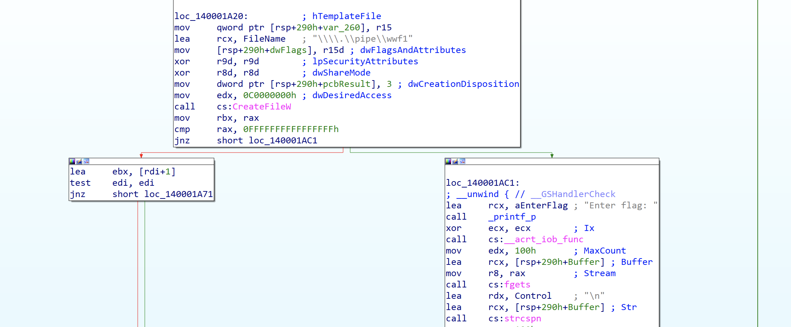
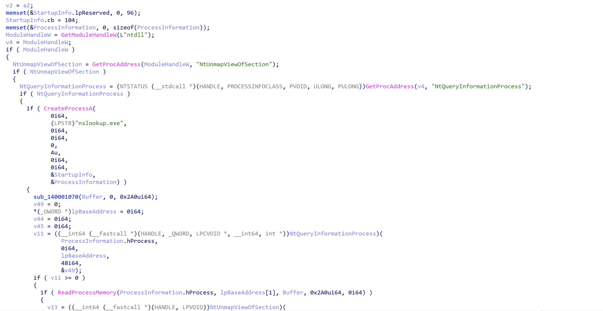
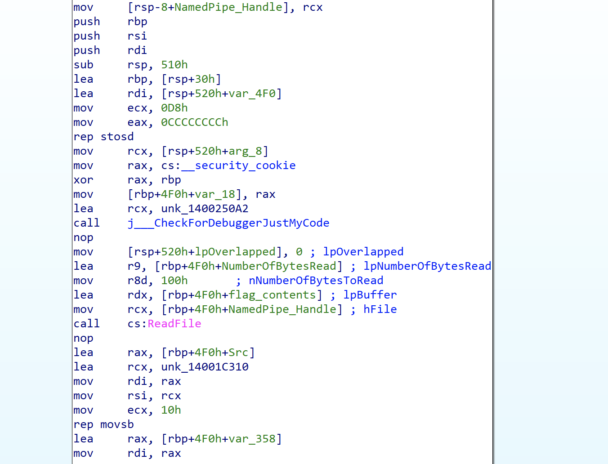
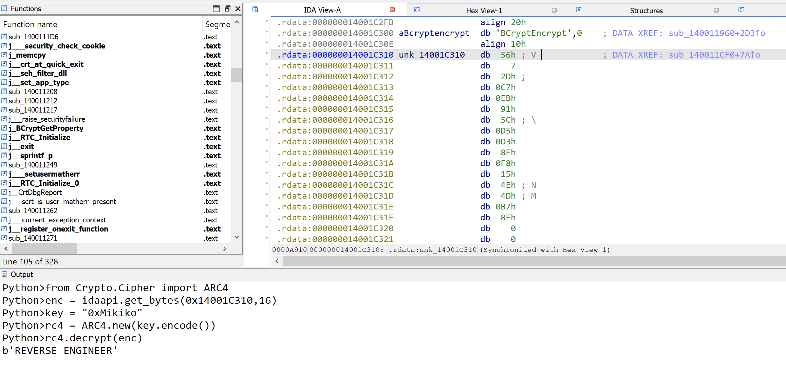
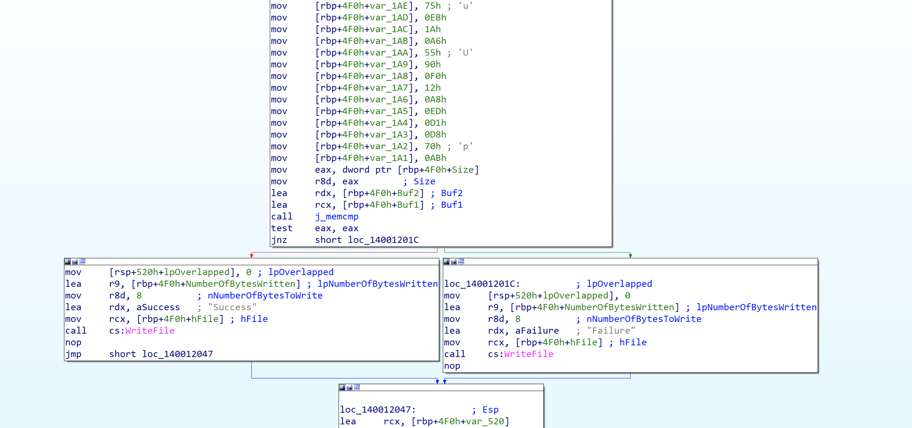

# World Wide CTF 2024 - Flag Checker reverse engineering write up

| Challenge name | Flag Checker |
| -- | -- |
| Solution Author | Sudeep Singh |
| Category | Reverse engineering|

## Summary

In this challenge, we have a 64-bit Windows binary that accepts a command line argument of length 4 characters. Once the correct 4 characters are provided as the command line argument, it asks the user to enter a flag that will be validated.

The implementation of flag checking routine used an interesing concept of IPC (Inter Process Communication). The main binary sends the flag to be validated to the code injected in another process via a named pipe. All the flag validation happens over named pipe.

## Contents
- Initial analysis
	- TLS Callback
- Decrypting the encrypted resource
	- Finding the 16-byte XOR Key
		- Method 1
		- Method 2
- Usage of named pipe for flag validation
	- Code injection into nslookup.exe
- Flag validation in decrypted binary
- AES decryption

## Initial analysis

Upon execution, the binary prompts the user to enter a 4 character string. Quick analysis of the main subroutine reveals that the binary expects a 4 character string as a command line argument. This input will be stored in the `pbInput` variable in .data section.

Code section below performs the check on the command line argument. Before proceeding, it is important to note that there is a TLS Callback implemented in this binary which writes a fake value to the `pbInput` in .data section before the main function is executed. If no command line argument is provided, then this fake 4 byte value will be used by the binary.



Code section below shows the TLS callback



## Decrypting the encrypted resource

Binary in this case has an encrypted resource. This resource stores an encrypted Windows binary. The main function will read the contents of this resource into a memory region allocated with `malloc`.

It then calculates a 16-byte MD5 hash of the 4-character input string and uses this 16-byte hash as an XOR key to decrypted the encrypted resource.

Code section below shows the decryption routine.



So, we have to find the correct 4-character input string that results in correct decryption of the resource. There are 2 ways to do this. I will explain both the methods below. Method 1 uses a clever trick to quickly locate the 16-byte XOR key in the encrypted resource itself. While Method 2 uses the more conventional bruteforce approach.

### Method 1

We can open the binary in CFF explorer and browse the encrypted resource. Since we know that the resource corresponds to an encrypted Windows binary, we can assume that the last few bytes are null bytes in the original binary (this is usually the case). Now applying the concept that any byte XOR'ed with a null byte results in that byte itself, we can quickly find the 16-byte XOR key in locations where we would have null bytes.

The image below shows the 16-byte decryption key located this way. Now we just need to use this 16-byte XOR key to decrypt the resource.



### Method 2

In the second method, we can use the more conventional bruteforce approach. We will try all combinations of strings of length 4 containing ASCII characters, that result in a decrypted resource corresponding to a Windows binary. Since all Windows binaries have an MZ header, we will compare each decrypted result with the first 4 bytes of the MZ header to see if we found the correct input.

```
import hashlib

_input = ""

# read the encrypted resource
with open("enc.bin", "rb") as f:
	enc = f.read()

enc_16 = enc[:16]
mz_header = b'\x4d\x5a\x90\x00'

counter = 0
# used to track whether we found correct _input and break out of nested FOR loops
found = False
for i in range(0x20, 0x7f):
	for j in range(0x20, 0x7f):
		for k in range(0x20, 0x7f):
			for l in range(0x20, 0x7f):
				_input = chr(i) + chr(j) + chr(k) + chr(l)
				m = hashlib.md5()
				m.update(_input.encode())
				key = m.digest()
				# xor decrypt
				dec_mz = []
				for _i in range(16):
					dec_mz.append(key[_i] ^ enc_16[_i])
				if bytearray(dec_mz)[:4] == mz_header:
					print(f"Correct input is: {_input}")
					found = True
					break
				# Capture the status of bruteforce
				counter += 1
				if counter % 1000000 == 0:
					print(f'Iteration count: {counter}, bruteforcing the _input: {_input}')
			if found:
				break
		if found:
			break
	if found:
		break

```

## Usage of named pipe for flag validation

Now that we have successfully decrypted the resource, let's continue analysing the main function in the original binary to see how it validates the flag.

It first creates a named pipe with the name `\\\\.\\pipe\\wwf1`. After this, it prompts the user to enter the flag and stores the flag in a buffer. The length of the flag should be less than or equal to 0x100 characters.



### Code injection into nslookup.exe

The subroutine at address: `0x1400011A0` is used to inject the decrypted resource into nslookup.exe process.



The main function then writes the entered flag to the named pipe for validation. We now need to check how the code injected in nslookup.exe validates this flag.

## Flag validation in decrypted binary

Since we know that the value of the flag is communicated to the injected code via a named pipe, let us look for code section calling `ReadFile` to read the value from the named pipe.

Code section below shows the injected code reading the flag from the named pipe and then using it to perform validation



Below are the main steps used for validation.

1. Decrypt the 16-byte value at address `0x14001C310` using RC4 algorithm with the RC4 key `0xMikiko`. This results in the string: `REVERSE ENGINEER` as shown below



2. Subroutine at address: `0x140011172` performs AES encryption of the flag using the block cipher mode - CBC. The key and IV are both set to the same value: `REVERSE ENGINEER`
3. The condition for correct flag is that the encrypted value of the flag should be the same as the byte array at address: `rbp+4F0h+Buf2`. This comparison is done using memcmp.

Code section below shows the comparison.



## AES decryption

In order to decrypt the flag, we can use the AES key and AES IV along with the encrypted bytes at address `rbp+4F0h+Buf2` to retrieve the original flag.

```
from Crypto.Cipher import AES

key = "REVERSE ENGINEER".encode()
iv = key

enc_bytes = bytes([bytes([
    0xB7, 0xA8, 0x36, 0x83, 0xA3, 0x63, 0x5B, 0x70,
    0x8D, 0xEF, 0xA8, 0xB7, 0xA5, 0x58, 0x9A, 0x18,
    0x56, 0xAC, 0x6F, 0x1F, 0xE3, 0x5F, 0xE3, 0x0E,
    0x98, 0xD9, 0xA7, 0x85, 0x51, 0x90, 0x1E, 0x2C,
    0xD3, 0x48, 0x43, 0xB8, 0xE2, 0x02, 0xB8, 0x48,
    0x4C, 0x52, 0x55, 0x8A, 0x16, 0x2E, 0xBD, 0xDB,
    0x10, 0x2A, 0x75, 0xEB, 0x1A, 0xA6, 0x55, 0x90,
    0xF0, 0x12, 0xA8, 0xED, 0xD1, 0xD8, 0x70, 0xAB
])])

aes = AES.new(key, AES.MODE_CBC, iv)
dec = aes.decrypt(enc_bytes)

print(f"flag is: {dec}")
```

Flag: `wwf{Try_t0_c0mmun1c4t3_by_p1p3_H0p3_Y0u_L1k3_It}`
